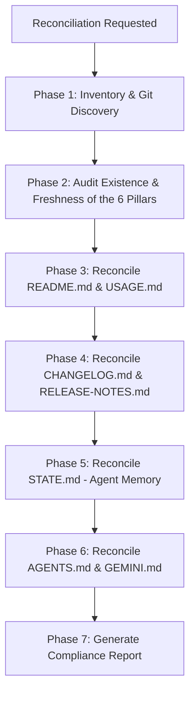

# Technical Documentation Hub (SOTA Edition)

Generates, maintains, and reconciles technical documentation at the **SOTA (State of the Art)** level, ensuring all artifacts are dense, rich in information, of ultra-high-quality grade, and hand-made tailored, eliminating placeholders, generic text, or drift from the actual code.

---

## The Canonical Suite of 6 Pillars

All document reconciliation executed by this skill audits and synchronizes the canonical suite of 6 pillars:

| Pillar / Document | Role & Responsibility | Expected Density |
|---|---|---|
| **1. `README.md`** | Executive entrance port of the repository. Presents an overview, architecture diagram, badges, quick start, and module map. | High (Mermaid diagrams, tables, quick setup) |
| **2. `CHANGELOG.md`** | Chronological and categorized change history based on the Keep a Changelog standard and SemVer. | High (versions with Added, Changed, Fixed, etc.) |
| **3. `USAGE.md`** | Practical operational guide. Details end-to-end scenarios, pipelines, CLI flags, and verifiable real commands. | Very High (terminal examples, sequential flows) |
| **4. `RELEASE-NOTES.md`** | Release notes focused on business value, architectural highlights, breaking changes, and migration guides. | Very High (highlights, metrics, and upgrade steps) |
| **5. `STATE.md`** | Persistent memory of the AI agent. Records active context, current architecture, session history, and open technical debts. | Very High (active ADR tables, registry debt tables) |
| **6. `AGENTS.md` / `GEMINI.md`** | Universal execution rules, operational restrictions, and governance for autonomous agents (Kilocode, Gemini, Antigravity). | Very High (invariants, hard-gates, and CLI reference) |

> **Mandatory Reconciliation Rule:** When executing document reconciliation, if any of the 6 pillars are outdated, **update** them; if non-existent, **create** them immediately using the corresponding template and extracting real data from the codebase and Git.

---

## Sub-Domain / Component: `documentation-reconciliation`

# Documentation Reconciliation

Audits and reconciles canonical documentation against the actual code, Git history, ADRs, and technical debt registry.

### ⚠️ Token Optimization (Skip Consolidated ADRs)
When you need to sweep ADRs from the repository to get context, **FIRST** read `docs/adr/ADR-INDEX.md` or a `grep` on the frontmatter of ADRs.
You are **PROHIBITED** from reading the complete content (via `view_file` or `cat`) of any file with the tag `implementation_status: CONSOLIDATED` in its frontmatter YAML. Apply the 'SKIP' summary to these files.

## When to Use

### Use when:
- Document reconciliation is requested (`/technical-documentation`, "reconcile documentation", "update documentation")
- Any of the 6 pillars (`README.md`, `CHANGELOG.md`, `USAGE.md`, `RELEASE-NOTES.md`, `STATE.md`, `AGENTS.md`/`GEMINI.md`) are absent or outdated
- After new features, refactorings, or ADR cycles are completed
- Before releases, deploys, or package/skill publications
- Inconsistencies between code and documentation are detected

### Do not use when:
- Creating isolated architectural decisions (use `adr-generator`)
- Auditing and archiving TODO tasks (use `adr-archive` / `audit.py`)

### Related Skills:
- `adr-generator` — creates ADRs and Decision Sets
- `adr-archive` — lifecycle, Evidence Records (ER.md), and tech debt pruning
- `implementation` — executes planned architectural changes
- `governance` — repository branching, PR and release standards
- `changelog-generator` — automated changelog diff categorization

## Decision Tree



## Reconciliation Workflow Step-by-Step

### Phase 1: Deep Inventory & Git Discovery
1. Execute Git inspection commands:
   ```bash
   git status
   git log --oneline -30
   git diff --stat HEAD~5..HEAD 2>/dev/null || git status
   ```
2. Analyze the repository file tree, main modules, and packages (`package.json`, `Cargo.toml`, etc.).
3. Consult the governance state:
   - Read `docs/adr/ADR-INDEX.md` (if exists) to identify active and consolidated ADRs.
   - Read `docs/governance/tech-debt-registry.json` to map open and resolved technical debts.

### Phase 2: Audit the 6 Canonical Pillars
For each of the 6 canonical files in the repository root:
- Verify if the file exists.
- If not exists: mark as `CREATE_OBLIGATORY`.
- If exists: read and compare against the actual code/Git state to identify outdated sections (`UPDATE_DEFASADO`).

### Phase 3: Reconcile `README.md` and `USAGE.md`
1. **`README.md`:**
   - Ensure badges are updated (version, status, license).
   - Include a concise overview and Mermaid architecture diagram reflecting the actual modules.
   - Provide a quick start with real installation commands and a directory tree map.
2. **`USAGE.md`:**
   - Detail real end-to-end scenarios, pipelines, and verifiable CLI commands.
   - Include a troubleshooting section based on common errors.

### Phase 4: Reconcile `CHANGELOG.md` and `RELEASE-NOTES.md`
1. **`CHANGELOG.md`:**
   - Structure in compliance with Keep a Changelog.
   - Map recent commits and fill the `Added`, `Changed`, `Fixed`, `Deprecated`, `Removed`, `Security` sections.
2. **`RELEASE-NOTES.md`:**
   - Summarize the main milestones and business value delivered in the version.
   - Document breaking changes explicitly.
   - Add a migration guide with step-by-step instructions and a count of mitigated ADRs/debts.

### Phase 5: Reconcile `STATE.md` (Agent Memory)
1. **`STATE.md`:**
   - Record the current phase of the lifecycle and active branch.
   - Insert a consolidated table of all ADRs (extracted from `ADR-INDEX.md`).
   - Insert a table of all open technical debts (extracted from `tech-debt-registry.json`).
   - Summarize the recent session history and point to clear next steps.

### Phase 6: Reconcile `AGENTS.md` and `GEMINI.md`
1. **`AGENTS.md` & `GEMINI.md`:**
   - Document operational invariants of the repository (Hard-Gates of ER, prohibition of drive-by refactorings, scope isolation).
   - List official CLI governance commands (`audit.py . --archive`, `audit.py . --register-debt`).
   - Ensure agent execution rules reflect available tools and skills.

### Phase 7: Compliance Report & Handoff
1. Generate or update the report in `docs/DOCUMENTATION_AUDIT_REPORT.md` presenting:
   - A table with the 6 pillars and actions taken (`CREATE` / `UPDATE` / `MAINTAIN`).
   - Compliance Score of document integrity.
   - Highlight any remaining gaps.

---

## Sub-Domain / Component: `tech-docs-generator`

# Technical Documentation Generator

Generates technical documentation from in-depth analysis of the actual codebase (API references, system architecture, component guides, and integration manuals).

### Ultra High-Quality Grade Patterns:
- **Zero Fabrications:** Extract examples from the real codebase exclusively, never invent signatures or imports that do not exist.
- **Complete Typing:** Document all parameters, return types, raised exceptions, and error contracts.
- **Visual Diagrams:** Always include Mermaid diagrams (`sequenceDiagram`, `graph TD`) when describing data flows or architecture.

---

## Available Canonical Templates

| Template | Location | Corresponding Pillar | Copy Command |
|---|---|---|---|
| `readme.template.md` | `templates/readme.template.md` | `README.md` | `cp templates/readme.template.md README.md` |
| `changelog.template.md` | `templates/changelog.template.md` | `CHANGELOG.md` | `cp templates/changelog.template.md CHANGELOG.md` |
| `usage.template.md` | `templates/usage.template.md` | `USAGE.md` | `cp templates/usage.template.md USAGE.md` |
| `release-notes.template.md` | `templates/release-notes.template.md` | `RELEASE-NOTES.md` | `cp templates/release-notes.template.md RELEASE-NOTES.md` |
| `state.template.md` | `templates/state.template.md` | `STATE.md` | `cp templates/state.template.md STATE.md` |
| `agents.template.md` | `templates/agents.template.md` | `AGENTS.md` | `cp templates/agents.template.md AGENTS.md` |
| `gemini.template.md` | `templates/gemini.template.md` | `GEMINI.md` | `cp templates/gemini.template.md GEMINI.md` |

---

## Anti-patterns

### 🔴 Critical

#### Skeletal / Generic Documentation
**What is it:** Creating files with short text, unfilled placeholders (e.g., `{{TODO}}`, "Add text here"), or documentation that does not reflect the actual repository state.
**Why is it bad:** Creates unnecessary noise and degrades AI agent performance.
**How to avoid:** All generated documentation must be dense, rich in facts, with real data extracted from code, Git, ADRs, and registries.

#### Partial Reconciliation (Ignoring Pillars)
**What is it:** Updating only the README and ignoring `CHANGELOG.md`, `USAGE.md`, `RELEASE-NOTES.md`, `STATE.md`, or `AGENTS.md`.
**Why is it bad:** Creates desynchronization between the agent memory, version history, and operational instructions.
**How to avoid:** Systematically audit the 6 pillars in every invocation.

#### Fabricating Code Examples
**What is it:** Inventing functions, imports, or routes that do not exist in the codebase.
**Why is it bad:** Users and agents copy examples that fail immediately.
**How to avoid:** Always read the real code source before writing examples for `USAGE.md` or API docs.

### 🟡 Medium

#### Changelog Out of Standard
**What is it:** Listing commits without categorization (`Added`, `Changed`, `Fixed`).
**Why is it bad:** Difficult to read for humans and automation tools.
**How to avoid:** Follow the Keep a Changelog standard.

#### STATE.md Disconnected from Tech Debt Registry
**What is it:** Listing technical debts in `STATE.md` that do not exist in `tech-debt-registry.json` or vice versa.
**Why is it bad:** Breaks the integrity of the single source of truth.
**How to avoid:** Extract the debt table directly from the official JSON.

---

## Checklists

### Reconciliation Checklist of the 6 Pillars
- [ ] **`README.md`:** Badges, overview, architecture (Mermaid), quick start, and directory tree map present and updated.
- [ ] **`CHANGELOG.md`:** Versions and categories (Added, Changed, Fixed, etc.) synchronized with real commits.
- [ ] **`USAGE.md`:** Practical guide with real commands, usage scenarios, and troubleshooting.
- [ ] **`RELEASE-NOTES.md`:** Highlights, breaking changes, migration guide, and metrics consolidated.
- [ ] **`STATE.md`:** Agent memory updated with active branch, ADRs, and technical debt registry.
- [ ] **`AGENTS.md` / `GEMINI.md`:** Operational invariants, hard-gates, and CLI reference for AI agents synchronized.
- [ ] **Compliance Report:** `docs/DOCUMENTATION_AUDIT_REPORT.md` generated documenting changes.

---

## References

- [Keep a Changelog](https://keepachangelog.com/pt-BR/1.0.0/)
- [Semantic Versioning 2.0.0](https://semver.org/lang/pt-BR/)
- [ADR Generator](../adr-generator/SKILL.md) — for ADR lifecycle
- [ADR Archive](../adr-archive/SKILL.md) — for auditing and governance of artifacts