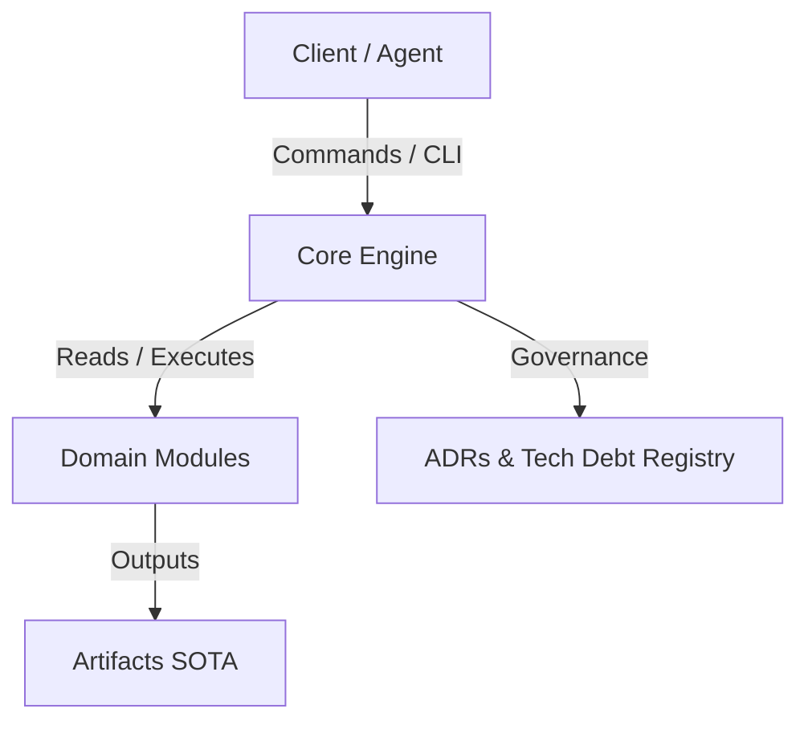

# {{PROJECT_NAME}}

> {{PROJECT_PITHY_TAGLINE}}

[](./CHANGELOG.md)
[]()
[](./docs/adr/)
[](./LICENSE)

---

## 1. Overview & Architecture

{{PROJECT_DESCRIPTION}}



### Key Capabilities
- **{{CAPABILITY_1_TITLE}}**: {{CAPABILITY_1_DESC}}
- **{{CAPABILITY_2_TITLE}}**: {{CAPABILITY_2_DESC}}
- **{{CAPABILITY_3_TITLE}}**: {{CAPABILITY_3_DESC}}

---

## 2. Quick Start

### Prerequisites
- {{PREREQUISITE_1}}
- {{PREREQUISITE_2}}

### Installation & Setup
```bash
# Clone and navigate to the repository
git clone {{REPO_URL}}
cd {{REPO_NAME}}

# Install dependencies or configure the environment
{{INSTALL_COMMAND}}
```

---

## 3. Module Map & Repository Structure

```text
{{DIRECTORY_STRUCTURE_TREE}}
```

| Module / Directory | Responsibility | Documentation |
|---|---|---|
| `docs/` | Governance, architecture, and specifications | [Docs Overview](./docs/) |
| `docs/adr/` | Decision Records and evidence reports | [ADR Index](./docs/adr/ADR-INDEX.md) |
| `docs/governance/` | Structured tech debt registry | [Tech Debt Registry](./docs/governance/tech-debt-registry.json) |

---

## 4. Operation Guide & Canonical Documentation

Refer to the canonical documentation suite for specific guidelines:

- 📖 **[Usage Guide (USAGE.md)](./USAGE.md)**: End-to-end workflows and CLI references.
- 📜 **[Change History (CHANGELOG.md)](./CHANGELOG.md)**: Keep a Changelog record of all versions.
- 🚀 **[Release Notes (RELEASE-NOTES.md)](./RELEASE-NOTES.md)**: Release highlights and migration guides.
- 🧠 **[Agent Memory State (STATE.md)](./STATE.md)**: Active context, recent decisions, and open tech debt.
- 🤖 **[Agent Instructions for AI (AGENTS.md)](./AGENTS.md)** / **[GEMINI.md](./GEMINI.md)**: Autonomous execution rules.

---

## 5. Governance & Contribution

This repository strictly follows the ADR-driven governance model and scope isolation.
To submit contributions or refactorings:
1. Open or consult the corresponding ADR in `docs/adr/`.
2. Do not perform *drive-by refactorings*; register tech debt in `tech-debt-registry.json`.
3. Validate conformance by running tests and linters before submitting PRs.