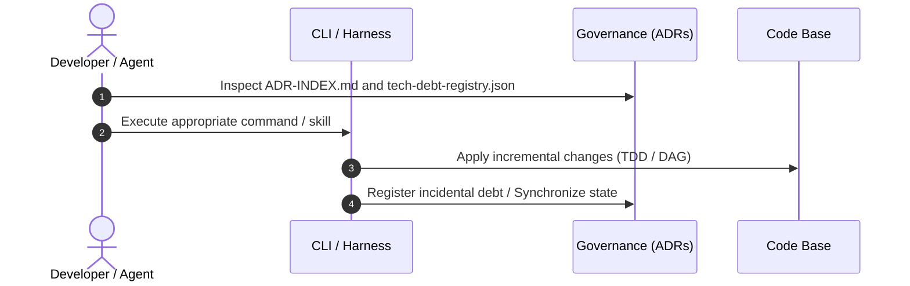

# Usage and Operation Guide (USAGE.md)

> Technical and practical manual of commands, operational flows, and pipelines of the repository.

---

## 1. Main Workflow Flow



---

## 2. Frequent Commands & CLI Reference

### 2.1 Build and Validation Commands
```bash
# Run unit test suite
{{CMD_TESTS}}

# Run static type checking and lint verification
{{CMD_LINT}}
```

### 2.2 Governance and ADR Audit
```bash
# Run silent ADR audit (cost 0 tokens)
python3 ~/.gemini/config/skills/adr-archive/scripts/audit.py .

# Archive completed ADR and generate Evidence Record (ER.md)
python3 ~/.gemini/config/skills/adr-archive/scripts/audit.py . --archive {{ADR_ID}}

# Register incidental technical debt
python3 ~/.gemini/config/skills/adr-archive/scripts/audit.py . --register-debt \
  --severity HIGH \
  --domain {{DOMAIN}} \
  --desc "{{DESCRIPTION}}" \
  --origin "implementation:{{ADR_ID}}"
```

---

## 3. Step-by-Step Scenario Guide

### Scenario 1: {{SCENARIO_1_NAME}}
**Objective:** {{SCENARIO_1_OBJECTIVE}}

1. **Step 1:** Prepare:
   ```bash
   {{SCENARIO_1_CMD_1}}
   ```
2. **Step 2:** Validate result:
   ```bash
   {{SCENARIO_1_CMD_2}}
   ```

### Scenario 2: {{SCENARIO_2_NAME}}
**Objective:** {{SCENARIO_2_OBJECTIVE}}

1. **Step 1:** {{SCENARIO_2_STEP_1}}
2. **Step 2:** {{SCENARIO_2_STEP_2}}

---

## 4. Error Handling and Troubleshooting

| Symptom / Error | Probable Cause | Corrective Action |
|---|---|---|
| `UNRESOLVED_DEPENDENCY` | Unconsolidated code base ADR | Wait or finalize the implementation of the listed dependency |
| `NEEDS_ER` | Completed ADR without Evidence Record | Run `audit.py . --archive <ADR_ID>` to materialize the ER |
| Lint Validation Failure | Formatting or type violation | Run local linter/typechecker before commit |