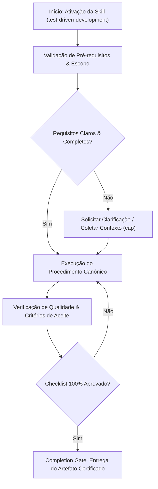

# Test-Driven Development

## When to Use

### Use when:
- Implementing any new feature, algorithm, domain logic, or bugfix
- Enforcing strict RED-GREEN-REFACTOR cycles with rapid feedback
- Building high-confidence test suites with high mutation scores ($MS \ge 0.85$)

### Do not use when:
- Throwaway visual spike prototypes where code will be discarded entirely

## Overview

TDD enforces the RED-GREEN-REFACTOR cycle as an unbreakable discipline: write a failing test, make it pass with minimal code, then clean up. This skill prevents untested production code from ever existing and ensures every line of implementation is driven by a verified requirement.

**Announce at start:** "I'm using the test-driven-development skill with the RED-GREEN-REFACTOR cycle."

---

## Iron Law

```
┌─────────────────────────────────────────────────────────────────┐
│  HARD-GATE: NO PRODUCTION CODE WITHOUT A FAILING TEST FIRST    │
│                                                                 │
│  This is non-negotiable. There are no exceptions. If you are   │
│  writing production code and there is no failing test demanding │
│  that code, you are violating this skill. STOP immediately     │
│  and write the test first.                                     │
└─────────────────────────────────────────────────────────────────┘
```

---

## Phase 1: RED (Write a Failing Test)

**Goal:** Write exactly ONE test that fails for the right reason.

### Actions

1. Identify the smallest unit of behavior to implement next
2. Write a test that asserts that behavior exists
3. Run the test suite — confirm the new test FAILS
4. Read the failure message — confirm it fails for the RIGHT reason (missing functionality, not syntax error or import error)
5. If it fails for the wrong reason, fix the test until it fails correctly

### STOP — HARD-GATE: Do NOT proceed to GREEN until:
- [ ] Test is written and saved
- [ ] Test suite has been run
- [ ] New test fails
- [ ] Failure reason is correct (tests the intended behavior)

---

## Phase 2: GREEN (Make It Pass)

**Goal:** Write the MINIMUM production code to make the failing test pass.

### Actions

1. Write only enough code to make the failing test pass
2. Do NOT refactor. Do NOT clean up. Do NOT optimize
3. Hardcode values if that makes the test pass — that is fine
4. Run the full test suite
5. ALL tests must pass (not just the new one)

### STOP — HARD-GATE: Do NOT proceed to REFACTOR until:
- [ ] Production code is written
- [ ] Full test suite has been run
- [ ] ALL tests pass (new and existing)
- [ ] No more code was written than necessary

---

## Phase 3: REFACTOR (Clean Up)

**Goal:** Improve code quality without changing behavior.

### Actions

1. Look for duplication, poor naming, long methods, code smells
2. Make ONE refactoring change at a time
3. Run the full test suite after EACH change
4. If any test fails, undo the refactoring immediately
5. Continue until the code is clean

### STOP — HARD-GATE: Do NOT proceed to next RED until:
- [ ] Code is clean and readable
- [ ] All tests still pass after refactoring
- [ ] No behavior was changed during refactoring

---

## HARD-GATE Enforcement

```
┌─────────────────────────────────────────────────────────────┐
│  HARD-GATE: PHASE COMPLETION CHECK                          │
│                                                             │
│  Before moving to next phase, ALL items in the              │
│  STOP MARKER checklist must be satisfied.                   │
│                                                             │
│  If ANY item is not satisfied:                              │
│  → STOP                                                    │
│  → Complete the missing item                               │
│  → Re-verify ALL items                                     │
│  → ONLY THEN proceed                                       │
└─────────────────────────────────────────────────────────────┘
```

---

## Watch Mode Discipline

After every change to any file (test or production), run the relevant test suite. No exceptions.

| Action | Run Tests? | Expected Result |
|--------|-----------|----------------|
| Write a test | Yes | Failure (RED) |
| Write production code | Yes | Pass (GREEN) |
| Refactor code | Yes | Pass (still GREEN) |
| Any other edit | Yes | No regressions |

If your test runner supports watch mode, use it. If not, run tests manually after every save.

---

## Decision Table: Test Type Selection

| Behavior Being Tested | Test Type | Framework Example |
|-----------------------|-----------|-------------------|
| Pure function logic | Unit test | Vitest, pytest, cargo test |
| API endpoint request/response | Integration test | Supertest, httpx |
| Database query correctness | Integration test | Testcontainers |
| UI component rendering | Unit test | React Testing Library |
| Full user workflow | E2E test | Playwright |
| Error handling path | Unit test | Vitest, pytest |

---

## Example Cycle

```
Requirement: "Users can register with email and password"

Behavior List:
1. Registration with valid email and password succeeds
2. Registration fails if email is empty
3. Registration fails if password is too short
4. Registration fails if email is already taken

Cycle 1 - Behavior 1:
  RED:   test_registration_with_valid_email_and_password_succeeds → FAIL (no register function)
  GREEN: def register(email, password): return User(email=email) → PASS
  REFACTOR: rename variable for clarity → PASS

Cycle 2 - Behavior 2:
  RED:   test_registration_fails_if_email_is_empty → FAIL (no validation)
  GREEN: add if not email: raise ValueError → PASS
  REFACTOR: extract validation to separate method → PASS

...continue for each behavior...
```

---

## Checklist: Starting a New Feature with TDD

1. [ ] Understand the requirement fully before writing any code
2. [ ] Break the requirement into a list of specific behaviors
3. [ ] Order behaviors from simplest to most complex
4. [ ] Create a task for the first behavior
5. [ ] Enter RED phase: write failing test for first behavior
6. [ ] Enter GREEN phase: write minimal code to pass
7. [ ] Enter REFACTOR phase: clean up
8. [ ] Create task for next behavior, repeat from step 5
9. [ ] After all behaviors are implemented, run full test suite
10. [ ] Invoke `verification-before-completion` before claiming done

---

## Test Quality Standards

Each test must be:

| Standard | Definition |
|----------|-----------|
| **Fast** | Milliseconds, not seconds |
| **Isolated** | No shared state between tests, no test ordering dependencies |
| **Repeatable** | Same result every time, no flakiness |
| **Self-validating** | Pass or fail, no manual interpretation needed |
| **Timely** | Written before the production code (that is the whole point) |

Each test should:
- Test ONE behavior or scenario
- Have a descriptive name that explains the scenario and expected outcome
- Follow Arrange-Act-Assert (or Given-When-Then) structure
- Use the minimum setup necessary
- Assert outcomes, not implementation details

---

## Anti-Patterns / Common Mistakes

| Anti-Pattern | Why It Is Wrong | Correct Approach |
|-------------|----------------|-----------------|
| Writing production code first | Defeats the purpose of TDD; tests shaped to pass | Write the test first, always |
| Writing multiple tests before any code | Batch testing defeats incremental design | One test, one cycle |
| Test passes on first run | Either test is wrong or behavior already exists | Investigate before proceeding |
| Spending >5 minutes in GREEN | Writing too much code at once | Simplify; make test more specific |
| Modifying tests to match code | Tests specify behavior; code must match tests | Fix the code, not the test |
| Skipping REFACTOR phase | Technical debt accumulates rapidly | Refactor every cycle |
| Not running tests after every change | Regressions go unnoticed | Run tests after every save |

---

## Rationalization Prevention

| Excuse | Reality |
|--------|---------|
| "It's just a small change" | Small changes cause production outages. Test it. |
| "I'll write the tests after" | You will not. And if you do, they will be weaker because they were shaped to pass, not to specify. |
| "This is just a refactor" | Refactors change behavior more often than you think. The test suite proves they do not. |
| "I know this works" | You do not. You think you do. The test proves it. |
| "Tests would slow me down" | Debugging without tests slows you down 10x more. |
| "This code is too simple to test" | If it is too simple to test, it is too simple to get wrong — so the test will be trivial to write. Write it. |
| "I can't test this because of dependencies" | Then your design has a coupling problem. Fix the design. |
| "The test would be harder to write than the code" | That means you do not understand the requirements well enough. The test forces you to clarify. |
| "I'll just manually verify it" | Manual verification is not repeatable, not documented, and not trustworthy. |
| "This is throwaway/prototype code" | Prototype code has a habit of becoming production code. Test it now or regret it later. |
| "The framework makes it hard to test" | Use the framework's testing utilities, or isolate your logic from the framework. |
| "I'm under time pressure" | TDD is faster over any timeline longer than 20 minutes. The pressure is exactly why you need it. |

---

## Red Flags

If you observe any of these, STOP and reassess:

| Red Flag | What It Means | Action |
|----------|--------------|--------|
| Writing production code with no failing test | Immediate violation | Stop. Write the test. |
| Test passes immediately on first run | Test is wrong or behavior exists | Investigate before proceeding |
| More than 5 minutes in GREEN phase | Writing too much code | Simplify. Make test more specific. |
| Refactoring changes behavior | Test coverage has a gap | Add missing tests |
| Tests modified to pass | Requirements inverted | Fix code to match tests |
| Multiple tests before any production code | Batch testing defeats purpose | One test at a time |
| Test suite not run after a change | Regressions invisible | Run tests. Always. Every time. |

---

## Integration Points

| Skill | Relationship |
|-------|-------------|
| `verification-before-completion` | MUST be invoked before claiming any TDD work is complete |
| `systematic-debugging` | When a test fails unexpectedly during REFACTOR, switch to debugging |
| `code-review` | After completing a feature via TDD, review the test suite for completeness |
| `acceptance-testing` | Acceptance criteria drive the behavior list for TDD cycles |
| `planning` | Plan breaks features into behaviors suitable for TDD cycles |
| `testing-strategy` | Strategy defines frameworks; TDD defines the cycle |

---

## Test Types in TDD

| Type | Scope | Speed | When to Write |
|------|-------|-------|--------------|
| **Unit (Primary)** | Individual functions, methods, classes | Milliseconds | RED phase for every behavior |
| **Integration (Secondary)** | Component interactions | Seconds | After unit tests cover individual behaviors |
| **E2E (Tertiary)** | Complete user workflows | Seconds-minutes | Critical paths after unit and integration are solid |

---

## Skill Type

**RIGID** — The RED-GREEN-REFACTOR cycle is mandatory and cannot be reordered, skipped, or combined. Every phase has a HARD-GATE that must be satisfied before proceeding. No production code without a failing test first.


## Decision Workflow




## Anti-Patterns & Operational Guardrails

| Anti-Pattern | Severidade | Impacto Negativo | Mitigação Canônica |
|:---|:---:|:---|:---|
| **Execução Prematura sem Contexto** | 🔴 Critical | Alucinação de contexto e refatoração destrutiva | Ativar a skill `cap` para adquirir evidências mínimas antes de editar. |
| **Omissão de Checklists de Validação** | 🟡 Medium | Entrega de artefatos com inconsistências sintáticas | Executar rigorosamente o checklist passo a passo antes do handoff. |
| **Falta de Documentação de Decisões** | 🟢 Low | Perda de rastreabilidade técnica e drift arquitetural | Registrar trade-offs relevantes via skill `adr-generator`. |


## Edge Cases & Failure Modes

- **Ambiente Restrito / Read-Only:** Se o filesystem ou sandbox estiver bloqueado contra escrita, reportar o bloqueio com evidência imediata e gerar o patch em markdown diff.
- **Conflito de Especificação:** Caso encontre contradições entre a intenção do usuário e o SSOT (`AGENTS.md`), interromper e sinalizar as opções com trade-offs.
- **Timeout ou Exaustão de Contexto:** Em tarefas volumosas, decompor em sub-lotes atômicos utilizando a skill `subagent-driven-development`.


## Domain SOTA & Industry Engineering Standards

- **TDD Foundations:** Kent Beck's Test-Driven Development By Example, Martin Fowler's Mocks Aren't Stubs.
- **Rhythm & Cadence:** Strict RED-GREEN-REFACTOR cycle with sub-minute iteration loops.
- **Test Quality Verification:** Mutation Testing Score ($MS \ge 0.85$) and Code Coverage.
- **Transformation Priority Premise (TPP):** Robert C. Martin's TPP transformations from specific to general.

### Mutation Testing Score Formula:

$$MS = \frac{M_{\text{killed}}}{M_{\text{total}} - M_{\text{equivalent}}} \ge 0.85 \quad (85\%)$$

### Exhaustive Heuristic Decision Rules:
1. **Rule of Thumb 1 (Three Laws of TDD):**
   - You may not write production code until you have written a failing unit test.
   - You may not write more of a unit test than is sufficient to fail.
   - You may not write more production code than is sufficient to pass the failing test.
2. **Rule of Thumb 2 (Fake It Till You Make It):** In the Green phase, write the simplest code that passes (even returning hardcoded literals) to verify test harness.
3. **Rule of Thumb 3 (Refactor on Green Only):** Clean code and eliminate duplication ONLY when all tests are green.
4. **Rule of Thumb 4 (Fast Test Execution):** Unit test suite must execute in $<5$ seconds to maintain rapid feedback loop.

## Completion Gate & Verification
Before concluding TDD cycle:
- [ ] Red phase test failure verified before production code written
- [ ] Green phase test pass verified with minimal code
- [ ] Refactor phase completed with all tests remaining green