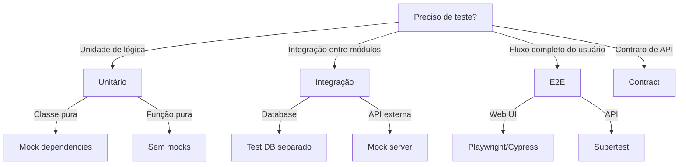

# Testing Mastery & Quality Assurance Hub

Unified testing framework covering unit, integration, acceptance, webapp, and strategy testing.


## Sub-Domain / Component: `testing`

# Testing

Guia para escrita de testes automatizados robustos.

## Quando Usar

### Use quando:
- Precisa escrever testes para nova funcionalidade
- Quer aumentar cobertura de testes existente
- Precisa definir estratégia de testes para projeto
- Quer padronizar testes entre equipes
- Precisa revisar qualidade de testes

### Não use quando:
- Trabalhando em script muito simples (protótipo)
- Projeto sem suporte a testes automatizados
- Precisa de teste manual (UI/UX)

### Skills relacionadas:
- `ddd` — para testar agregados e entidades de domínio
- `governance` — para políticas de coverage mínima

## Decision Tree



## Workflow

### Fase 1: Escrever Teste Unitário

1. Identifique a unidade a ser testada (classe, função, método)
2. Crie arquivo de teste ao lado do código fonte:
   ```bash
   # Estrutura
   src/
   ├── services/
   │   ├── user-service.ts
   │   └── user-service.test.ts
   ```
3. Use o template `templates/unit-test.ts`:
   ```bash
   cp templates/unit-test.ts src/services/user-service.test.ts
   ```
4. Preencha os placeholders do template
5. Execute o teste:
   ```bash
   npm test -- user-service.test.ts
   ```
6. **Checkpoint**: Teste passa e cobre caminho feliz

### Fase 2: Escrever Teste de Integração

1. Identifique o ponto de integração (database, API, serviço externo)
2. Configure ambiente de teste:
   ```bash
   # docker-compose.test.yml
   services:
     postgres:
       image: postgres:15
       environment:
         POSTGRES_DB: test_db
   ```
3. Use o template `templates/integration-test.ts`
4. Configure setup/teardown no `beforeAll`/`afterAll`
5. Execute testes:
   ```bash
   npm run test:integration
   ```
6. **Checkpoint**: Teste passa e verifica persistência

### Fase 3: Escrever Teste E2E

1. Identifique o fluxo crítico do usuário
2. Configure ambiente E2E:
   ```bash
   # .env.test
   BASE_URL=http://localhost:3000
   ```
3. Use o template `templates/e2e-test.ts`
4. Adicione `data-testid` aos elementos UI:
   ```html
   <button data-testid="submit-button">Submit</button>
   ```
5. Execute teste:
   ```bash
   npm run test:e2e
   ```
6. **Checkpoint**: Fluxo completo funciona

### Fase 4: Analisar Cobertura

1. Execute testes com coverage:
   ```bash
   npm run test:coverage
   ```
2. Abra relatório:
   ```bash
   open coverage/lcov-report/index.html
   ```
3. Identifique áreas sem cobertura
4. Crie plano de cobertura:
   ```bash
   cp templates/test-plan.md docs/test-plan.md
   ```
5. **Checkpoint**: Coverage ≥ 80% para unidades

### Fase 5: Refatorar com Testes como Safety Net

1. Execute todos os testes antes de refatorar:
   ```bash
   npm test
   ```
2. Refatore código mantendo API pública
3. Execute testes após cada mudança:
   ```bash
   npm test
   ```
4. Se teste quebra, revert ou ajuste refatoração
5. **Checkpoint**: Todos os testes passam após refatoração

## Conceitos Fundamentais

### Pirâmide de Testes

```
         /\
        /  \      E2E (poucos, críticos)
       /____\
      /      \    Integração (médio)
     /________\
    /          \  Unitários (muitos)
   /____________\
```

### AAA Pattern

```typescript
it('should return total when items provided', () => {
  // Arrange - preparar dados
  const cart = new ShoppingCart();
  const item = { id: 1, price: 100 };
  
  // Act - executar ação
  cart.addItem(item);
  const total = cart.getTotal();
  
  // Assert - verificar resultado
  expect(total).toBe(100);
});
```

### Naming Convention

Padrão: `should [expected behavior] when [condition]`

```typescript
// ✅ CORRETO
it('should throw ValidationError when email is invalid')
it('should return user when id exists')
it('should calculate total when items provided')

// ❌ ERRADO
it('test user')
it('email validation')
it('works')
```

## Templates

### unit-test.ts
Localização: `templates/unit-test.ts`

Template para testes unitários com Vitest/Jest.

**Uso:**
```bash
cp templates/unit-test.ts src/{module}/{module}.test.ts
```

### integration-test.ts
Localização: `templates/integration-test.ts`

Template para testes de integração com setup/teardown.

**Uso:**
```bash
cp templates/integration-test.ts test/integration/{module}.test.ts
```

### e2e-test.ts
Localização: `templates/e2e-test.ts`

Template para testes E2E com Playwright.

**Uso:**
```bash
cp templates/e2e-test.ts e2e/{flow}.spec.ts
```

### test-plan.md
Localização: `templates/test-plan.md`

Template para planejar cobertura de testes.

**Uso:**
```bash
cp templates/test-plan.md docs/test-plan.md
```

## Anti-patterns

### 🔴 Crítico

#### Test Leaky
**O que é:** Teste que depende de estado externo ou ordem de execução.
**Por que é ruim:** Testes passam/falham aleatoriamente, impossível debug.
**Como evitar:** Use setup/teardown, testes independentes.
**Exemplo:**
```typescript
// ❌ ERRADO - depende de banco real
it('should create user', () => {
  const user = userService.createUser({ name: 'John' });
  // espera que user.id seja 1 - pode falhar se outro teste rodou antes
  expect(user.id).toBe(1);
});

// ✅ CORRETO - isolado
it('should create user', async () => {
  await setupTestDatabase();
  const user = await userService.createUser({ name: 'John' });
  expect(user.id).toBeDefined();
  await teardownTestDatabase();
});
```

#### Mock Excessivo
**O que é:** Mockar tudo, incluindo código que deveria ser testado.
**Por que é ruim:** Teste não valida integração real, falso positivo.
**Como evitar:** Mock apenas dependências externas.
**Exemplo:**
```typescript
// ❌ ERRADO - mockando tudo
const result = await jest.fn().mockReturnValue('mocked');

// ✅ CORRETO - mockando apenas externo
const httpClient = new MockHttpClient();
const service = new UserService(httpClient);
```

### 🟡 Médio

#### Test Sem Assertion
**O que é:** Teste que não verifica nada.
**Por que é ruim:** Teste sempre passa, não detecta bugs.
**Como evitar:** Sempre use expect().
**Exemplo:**
```typescript
// ❌ ERRADO
it('should work', () => {
  userService.createUser({ name: 'John' });
});

// ✅ CORRETO
it('should create user successfully', () => {
  const user = userService.createUser({ name: 'John' });
  expect(user.id).toBeDefined();
  expect(user.name).toBe('John');
});
```

#### Test Frágil
**O que é:** Teste que quebra com mudanças não relacionadas.
**Por que é ruim:** Alto custo de manutenção.
**Como evitar:** Use seletores estáveis, teste comportamento não implementação.
**Exemplo:**
```typescript
// ❌ ERRADO - usa classe CSS que muda
await page.click('.btn-primary');

// ✅ CORRETO - usa data-testid estável
await page.click('[data-testid="submit-button"]');
```

### 🟢 Baixo

#### Test com Lógica
**O que é:** Teste que contém lógica condicional ou loops.
**Por que é ruim:** Teste difícil de entender, pode ter bugs.
**Como evitar:** Teste uma coisa, sem lógica.
**Exemplo:**
```typescript
// ❌ ERRADO
it('should validate users', () => {
  users.forEach(user => {
    if (user.age > 18) {
      expect(validate(user)).toBe(true);
    }
  });
});

// ✅ CORRETO
it('should validate adult user', () => {
  const user = { name: 'John', age: 25 };
  expect(validate(user)).toBe(true);
});

it('should reject minor user', () => {
  const user = { name: 'Jane', age: 15 };
  expect(validate(user)).toBe(false);
});
```

## Checklists

### Checklist de Review de Teste
- [ ] Segue padrão AAA (Arrange, Act, Assert)
- [ ] Nome claro seguindo `should X when Y`
- [ ] Um conceito por teste
- [ ] Teste caminho feliz
- [ ] Teste caminhos de erro
- [ ] Teste edge cases
- [ ] Mocks apenas para dependências externas
- [ ] Não tem lógica no teste

### Checklist de Coverage
- [ ] Coverage ≥ 80% para unidades
- [ ] Coverage ≥ 70% para integração
- [ ] Coverage ≥ 60% para E2E
- [ ] Nenhum arquivo com < 50% coverage
- [ ] Nenhum branch não coberto
- [ ] Nenhum path não coberto

### Checklist de CI
- [ ] Testes rodam em CI
- [ ] Coverage é reportado
- [ ] Build falha se coverage < meta
- [ ] Testes paralelos habilitados
- [ ] Cache de dependências configurado

## Edge Cases

### Teste Dependente de Ordem
**Situação:** Teste A passa apenas se executado antes do Teste B.
**Solução:** Use `beforeEach`/`afterEach` para isolar estado.
**Exceção:** Testes de migração de banco podem precisar de ordem.

```typescript
// Isolar estado entre testes
beforeEach(() => {
  jest.clearAllMocks();
  testDb.clear();
});
```

### Flaky Test
**Situação:** Teste que passa/falha aleatoriamente.
**Solução:** Identifique causa (timing, estado compartilhado, rede) e isole.
**Exceção:** Testes com `setTimeout` para debounce podem ser flaky.

```typescript
// ❌ Pode ser flaky
await button.click();
expect(element).toBeVisible(); // timing issue

// ✅ Mais estável
await button.click();
await page.waitForSelector('[data-testid="element"]', { state: 'visible' });
expect(element).toBeVisible();
```

### Teste com I/O Externo
**Situação:** Teste faz chamada real a API externa.
**Solução:** Use mock server (MSW, nock) ou fixtures.
**Exceção:** Testes de contrato podem precisar de I/O real.

```typescript
// Usar MSW para mockar API
import { setupServer } from 'msw/node';
const server = setupServer(
  rest.get('/api/users', (req, res, ctx) => {
    return res(ctx.json([{ id: 1, name: 'John' }]));
  })
);
```

## Referências

- [Testing Library](https://testing-library.com/)
- [Vitest](https://vitest.dev/)
- [Playwright](https://playwright.dev/)
- `ddd` — para testar agregados
- `governance` — para políticas de CI/CD

---


## Sub-Domain / Component: `testing-strategy`

# Testing Strategy

## Overview

Analyze the project context and recommend a comprehensive testing strategy. This skill selects appropriate frameworks, defines the testing pyramid, establishes coverage thresholds, and generates test configuration files. The goal is a repeatable, measurable testing foundation that the team can maintain.

**Announce at start:** "I'm using the testing-strategy skill to define the testing approach."

---

## Phase 1: Analyze Project

**Goal:** Understand the current stack, existing tests, and CI setup before recommending anything.

### Actions

1. Identify the tech stack (language, framework, runtime)
2. Survey existing tests (what testing exists already?)
3. Review CI/CD pipeline (how do tests run?)
4. Measure current coverage levels
5. Map external dependencies (services, databases, APIs)

### Discovery Commands

```bash
# Identify test files
find . -name "*.test.*" -o -name "*.spec.*" | head -30

# Check for test config
ls vitest.config.* jest.config.* pytest.ini pyproject.toml .mocharc.* 2>/dev/null

# Check current coverage
cat coverage/coverage-summary.json 2>/dev/null || echo "No coverage report found"

# Check CI config
cat .github/workflows/*.yml 2>/dev/null | head -50
```

### STOP — Do NOT proceed to Phase 2 until:
- [ ] Tech stack is identified
- [ ] Existing test infrastructure is mapped
- [ ] CI pipeline status is known
- [ ] External dependencies are listed

---

## Phase 2: Recommend Testing Pyramid

**Goal:** Select frameworks and define the pyramid ratios.

### Framework Selection Table

| Stack | Unit | Integration | E2E |
|-------|------|-------------|-----|
| **Node.js/TS** | Vitest | Vitest + Supertest | Playwright |
| **React/Next.js** | Vitest + Testing Library | Vitest + MSW | Playwright/Cypress |
| **Python** | pytest | pytest + httpx | Playwright |
| **Go** | testing + testify | testing + testcontainers | Playwright |
| **Rust** | cargo test | cargo test + testcontainers | - |
| **PHP/Laravel** | Pest/PHPUnit | Pest + HTTP tests | Playwright/Dusk |

### Testing Pyramid Ratios

```
        /\
       /  \     E2E Tests (10%)
      /    \    Critical user journeys only
     /------\
    /        \   Integration Tests (30%)
   /          \  API endpoints, DB queries, service interactions
  /------------\
 /              \ Unit Tests (60%)
/                \ Pure functions, business logic, utilities
```

### What to Test at Each Level

| Level | Test These | Do NOT Test These |
|-------|-----------|------------------|
| **Unit (60%)** | Pure functions, business logic, data transformations, validations, state management | Framework internals, third-party libraries |
| **Integration (30%)** | API endpoints, database queries, service-to-service calls, auth flows | Individual functions in isolation |
| **E2E (10%)** | Critical user journeys (signup, purchase), cross-browser, accessibility | Edge cases (handle at unit level) |

### STOP — Do NOT proceed to Phase 3 until:
- [ ] Framework selection matches the tech stack
- [ ] Pyramid ratios are defined
- [ ] Testing scope at each level is documented

---

## Phase 3: Define Coverage Thresholds

**Goal:** Set realistic, enforceable coverage targets.

### Coverage Threshold Table

| Category | Minimum | Target | Notes |
|----------|---------|--------|-------|
| Overall | 70% | 85% | Lines covered |
| Critical paths | 90% | 95% | Auth, payments, data access |
| New code (PRs) | 80% | 90% | Enforced in CI |
| Utilities | 95% | 100% | Pure functions are easy to test |

### Threshold Selection Decision Table

| Project Maturity | Overall Minimum | New Code Minimum | Rationale |
|-----------------|----------------|-------------------|-----------|
| Greenfield | 80% | 90% | Start high, maintain standard |
| Active (good coverage) | 70% | 85% | Maintain and improve |
| Legacy (low coverage) | 50% | 80% | Raise floor gradually |
| Prototype/MVP | 60% | 70% | Cover critical paths, accept gaps |

### STOP — Do NOT proceed to Phase 4 until:
- [ ] Coverage thresholds are realistic for the project maturity
- [ ] Critical path coverage targets are defined
- [ ] CI enforcement strategy is decided

---

## Phase 4: Generate Configuration

**Goal:** Produce working test configuration files and CI integration.

### Actions

1. Generate test runner config (`vitest.config.ts`, `jest.config.js`, `pytest.ini`)
2. Configure coverage with thresholds
3. Add test commands to CI workflow
4. Set up test environment (`.env.test`, test databases)

### Example: Vitest Config

```typescript
import { defineConfig } from 'vitest/config';

export default defineConfig({
  test: {
    globals: true,
    environment: 'jsdom',
    coverage: {
      provider: 'v8',
      reporter: ['text', 'json', 'html'],
      thresholds: {
        lines: 80,
        functions: 80,
        branches: 80,
        statements: 80,
      },
    },
    include: ['src/**/*.test.{ts,tsx}'],
  },
});
```

### STOP — Do NOT proceed to Phase 5 until:
- [ ] Config files are syntactically valid
- [ ] Coverage thresholds match Phase 3 decisions
- [ ] CI integration commands are defined

---

## Phase 5: Create Test Templates

**Goal:** Provide example test files demonstrating project conventions.

### Actions

1. Create a unit test example with Arrange-Act-Assert
2. Create an integration test with setup/teardown
3. Create mock/stub patterns for external dependencies
4. Create test data factories/fixtures
5. Create a snapshot test example (when appropriate)

### STOP — Verification Gate before claiming complete:
- [ ] Framework selection matches tech stack
- [ ] Coverage thresholds are realistic
- [ ] Test configuration files are valid
- [ ] Example tests actually run
- [ ] CI integration is configured

---

## Anti-Patterns / Common Mistakes

| Anti-Pattern | Why It Is Wrong | Correct Approach |
|-------------|----------------|-----------------|
| Testing implementation details | Breaks on every refactor, provides false confidence | Test behavior and outcomes |
| Excessive mocking | Tests nothing real, mocks mask real failures | Mock at boundaries only |
| Brittle CSS selectors in E2E | Break with styling changes | Use data-testid or accessible roles |
| Test interdependence | Ordering failures, flaky in CI | Each test must run independently |
| Slow tests blocking CI | Developers skip running tests | Parallelize, use test databases, mock external APIs |
| Snapshot overuse | Snapshots approved without reading, stale baselines | Use for stable output only |
| No coverage enforcement in CI | Coverage degrades over time | Enforce thresholds in CI pipeline |
| Same coverage target everywhere | Utilities and critical paths differ | Use per-category thresholds |

---

## Decision Table: Mock Strategy

| Dependency Type | Mock Strategy | Example |
|----------------|--------------|---------|
| External API | MSW / nock / responses | Third-party payment API |
| Database | Test database or in-memory | PostgreSQL test container |
| File system | Virtual FS or temp directory | File upload processing |
| Time/Date | Fake timers | Expiration logic |
| Environment vars | Override in test setup | Feature flags |
| Random/UUID | Seed or stub | ID generation |

---

## Integration Points

| Skill | Relationship |
|-------|-------------|
| `test-driven-development` | Strategy defines frameworks; TDD defines the cycle |
| `acceptance-testing` | Strategy includes acceptance test infrastructure |
| `code-review` | Review checks that tests follow the defined strategy |
| `senior-frontend` | Frontend testing uses strategy-selected frameworks |
| `senior-backend` | Backend testing uses strategy-selected frameworks |
| `performance-optimization` | Load tests are part of the overall testing strategy |
| `webapp-testing` | Playwright E2E tests follow strategy pyramid |

---

## Key Principles

- **Test behavior, not implementation** — what it does, not how
- **Fast feedback** — unit tests should run in seconds
- **Deterministic** — no flaky tests, no time-dependent logic
- **Readable** — tests are documentation; make them clear
- **Maintainable** — tests should help refactoring, not block it

---

## Skill Type

**FLEXIBLE** — Adapt framework selection and coverage thresholds to the project context. The five-phase process and testing pyramid structure are strongly recommended but can be scaled to project size.

---


## Sub-Domain / Component: `acceptance-testing`

# Acceptance Testing

## Overview

Acceptance-driven backpressure connects specification acceptance criteria directly to test requirements, creating a validation chain that prevents premature completion claims. The system cannot cheat — you cannot claim a feature is done unless tests derived from spec acceptance criteria actually pass.

**Announce at start:** "I'm using the acceptance-testing skill to validate against specification criteria."

---

## The Backpressure Chain

```
+------------+     derives      +------------+     validates    +------------+
|   SPECS    |---------------->|   TESTS    |---------------->|   CODE     |
|            |                  |            |                  |            |
| Acceptance |                  | Test cases |                  | Must pass  |
| Criteria   |                  | from AC    |                  | all tests  |
+------------+                  +------------+                  +------------+
      ^                                                              |
      |                    backpressure                               |
      +--------------------------------------------------------------+
      If tests fail, implementation must change (not the spec or test)
```

---

## Phase 1: Extract Acceptance Criteria

**Goal:** From each specification file, extract all Given/When/Then acceptance criteria.

### Actions

1. Locate all specification files (`specs/*.md`)
2. Extract every acceptance criterion with its ID
3. Document in structured format

### Example Extraction

```markdown
## From spec: 01-color-extraction.md

### AC-1: Extract dominant colors
- Given an uploaded image (PNG, JPG, or WebP)
- When color extraction is triggered
- Then 5-10 dominant colors are returned
- And each color includes hex, RGB, and HSL representations

### AC-2: Handle invalid images
- Given a corrupted or unsupported file
- When color extraction is attempted
- Then an appropriate error is returned
- And no partial results are produced
```

### STOP — HARD-GATE: Do NOT proceed to Phase 2 until:
- [ ] All spec files are located and read
- [ ] Every acceptance criterion is extracted with an ID
- [ ] Criteria are in Given/When/Then format
- [ ] No criteria are ambiguous (if ambiguous, clarify with spec author)

---

## Phase 2: Derive Test Cases

**Goal:** Map every acceptance criterion to at least one test case.

```
┌─────────────────────────────────────────────────────────────────┐
│  HARD-GATE: Every acceptance criterion must have at least one   │
│  corresponding test. No exceptions. If a criterion has no       │
│  test, the feature is NOT complete.                             │
└─────────────────────────────────────────────────────────────────┘
```

### Traceability Table

| Acceptance Criterion | Test Type | Test Description | Test File:Line |
|---------------------|-----------|-----------------|----------------|
| AC-1: Extract dominant colors | Integration | Upload valid image, verify 5-10 colors with hex/RGB/HSL | test/color.test.js:15 |
| AC-2: Handle invalid images | Integration | Upload corrupted file, verify error, verify no partial data | test/color.test.js:42 |

### Decision Table: Test Type for Acceptance Criteria

| Criterion Type | Test Type | Rationale |
|---------------|-----------|-----------|
| Data input/output behavior | Integration | Tests real data flow |
| Error handling behavior | Integration | Tests error paths end-to-end |
| Performance requirement | Load test | Requires measurement under load |
| UI behavior | E2E (Playwright) | Tests real browser interaction |
| Subjective quality | LLM-as-judge | Cannot be deterministically tested |
| Security requirement | Integration + security test | Tests authorization and input validation |

### STOP — HARD-GATE: Do NOT proceed to Phase 3 until:
- [ ] Every acceptance criterion has at least one test mapped
- [ ] Test types are appropriate for the criterion type
- [ ] Test file locations are identified

---

## Phase 3: Write Tests Before Implementation

**Goal:** Write acceptance tests that will fail until the feature is correctly implemented.

### Actions

This phase integrates with `test-driven-development`:

1. Write test from acceptance criterion (RED)
2. Implement feature to pass test (GREEN)
3. Refactor while keeping test green (REFACTOR)

### Behavioral Outcome Focus

| Verify This (Behavioral) | NOT This (Implementation) |
|--------------------------|--------------------------|
| "5-10 colors are returned" | "K-means runs with k=8" |
| "Response time < 200ms" | "Cache is hit on second call" |
| "Error message is user-friendly" | "CustomError class is thrown" |
| "Data persists across sessions" | "PostgreSQL INSERT executes" |
| "UI updates within 500ms" | "WebSocket message is received" |

### STOP — HARD-GATE: Do NOT proceed to Phase 4 until:
- [ ] All acceptance tests are written
- [ ] Tests fail before implementation (RED confirmed)
- [ ] Tests verify behavioral outcomes, not implementation details

---

## Phase 4: Validation Gates

**Goal:** Before claiming any task complete, ALL gates must pass.

| Gate | Check | Tool | Required |
|------|-------|------|----------|
| Unit tests | All pass | Test runner | Always |
| Integration tests | All pass | Test runner | Always |
| Acceptance tests | All AC-derived tests pass | Test runner | Always |
| Build | Compiles without errors | Build tool | Always |
| Lint | No violations | Linter | Always |
| Typecheck | No type errors | Type checker | When applicable |

```
┌─────────────────────────────────────────────────────────────────┐
│  HARD-GATE: ACCEPTANCE                                         │
│                                                                 │
│  Cannot claim completion without ALL acceptance tests passing.  │
│  If any acceptance test fails, the feature is NOT done.        │
│  Fix the implementation, not the spec or the test.             │
└─────────────────────────────────────────────────────────────────┘
```

### STOP — HARD-GATE: Do NOT proceed to Phase 5 until:
- [ ] All validation gates pass
- [ ] Acceptance tests pass with green status
- [ ] No gates are skipped or marked as "will fix later"

---

## Phase 5: Traceability Report

**Goal:** Produce a report linking every spec criterion to its test and result.

### Report Template

```markdown
## Acceptance Test Report

| Spec | Criterion | Test | Status |
|------|-----------|------|--------|
| 01-color-extraction.md | AC-1: Extract dominant colors | test/color.test.js:15 | PASS |
| 01-color-extraction.md | AC-2: Handle invalid images | test/color.test.js:42 | PASS |
| 02-palette-rendering.md | AC-1: Render palette grid | test/palette.test.js:8 | PASS |

### Summary
- Total criteria: N
- Tested: N
- Passing: N
- Failing: 0
- Coverage: 100%
```

---

## Anti-Patterns / Common Mistakes

| Anti-Pattern | Why It Is Wrong | Correct Approach |
|-------------|----------------|-----------------|
| Changing specs to match implementation | Defeats the purpose of specification | Fix the implementation, not the spec |
| Skipping edge case criteria | Edge cases cause production bugs | ALL acceptance criteria get tests |
| Testing implementation details | Brittle tests that break on refactor | Test observable behavioral outcomes |
| Claiming "tests pass" without acceptance tests | Unit tests alone are insufficient | Acceptance tests are a separate, required category |
| Writing acceptance tests after implementation | Tests shaped to pass, not to specify | Write BEFORE implementation (TDD) |
| Deferring acceptance tests to "later" | Later never comes | Write them in Phase 2, before coding |
| Marking failing tests as "known issues" | Hides incomplete implementation | Fix the code until tests pass |

---

## Rationalization Prevention

| Excuse | Reality |
|--------|---------|
| "The unit tests cover this" | Unit tests test components in isolation; acceptance tests verify integrated behavior |
| "The spec is obvious, no need for formal tests" | Obvious specs still need verifiable tests |
| "We can manually verify this" | Manual verification is not repeatable or trustworthy |
| "The acceptance criteria are too vague to test" | Clarify the criteria; vague specs produce vague code |
| "This is just a cosmetic change" | Cosmetic changes can break layout, accessibility, and UX |

---

## Integration Points

| Skill | Relationship |
|-------|-------------|
| `spec-writing` | Acceptance criteria come from specs |
| `test-driven-development` | TDD cycle uses acceptance-derived tests |
| `llm-as-judge` | For subjective criteria that cannot be deterministically tested |
| `verification-before-completion` | Final verification includes acceptance test check |
| `autonomous-loop` | Exit gate requires acceptance tests passing |
| `code-review` | Review checks acceptance test coverage |
| `planning` | Plan includes acceptance test writing as explicit tasks |

---

## Skill Type

**RIGID** — The backpressure chain must not be bypassed. Every acceptance criterion must have a test. No completion without passing acceptance tests. Fix the implementation, not the spec or the test.

---


## Sub-Domain / Component: `webapp-testing`

# Web App Testing

## Overview

Comprehensive web application testing using Playwright as the primary tool. This skill covers end-to-end testing workflows including screenshot capture for visual verification, browser console log analysis, user interaction simulation, visual regression testing, accessibility auditing with axe-core, network request mocking, and mobile viewport testing.

**Announce at start:** "I'm using the webapp-testing skill for Playwright-based web application testing."

---

## Phase 1: Test Planning

**Goal:** Identify what to test and set up the infrastructure.

### Actions

1. Identify critical user flows to test
2. Define test environments and viewports
3. Set up test fixtures and data
4. Configure Playwright project settings
5. Establish visual baseline screenshots

### User Flow Priority Decision Table

| Flow Type | Priority | Test Depth |
|-----------|----------|-----------|
| Authentication (login/logout/register) | Critical | Full happy + error paths |
| Core business workflow (purchase, submit) | Critical | Full happy + error + edge cases |
| Navigation and routing | High | All major routes |
| Search and filtering | High | Common queries + empty state |
| Settings and profile | Medium | Happy path |
| Admin/back-office | Medium | Key operations only |

### STOP — Do NOT proceed to Phase 2 until:
- [ ] Critical user flows are identified and prioritized
- [ ] Test environments and viewports are defined
- [ ] Playwright config is ready
- [ ] Test data strategy is defined

---

## Phase 2: Test Implementation

**Goal:** Write tests using page object models and accessible locators.

### Actions

1. Write page object models for key pages
2. Implement end-to-end test scenarios
3. Add visual regression snapshots
4. Integrate accessibility checks
5. Configure network mocking for isolated tests

### Playwright Configuration

```typescript
import { defineConfig, devices } from '@playwright/test';

export default defineConfig({
  testDir: './tests/e2e',
  fullyParallel: true,
  forbidOnly: !!process.env.CI,
  retries: process.env.CI ? 2 : 0,
  workers: process.env.CI ? 1 : undefined,
  reporter: [
    ['html', { open: 'never' }],
    ['junit', { outputFile: 'test-results/junit.xml' }],
  ],
  use: {
    baseURL: 'http://localhost:3000',
    trace: 'on-first-retry',
    screenshot: 'only-on-failure',
    video: 'retain-on-failure',
  },
  projects: [
    { name: 'chromium', use: { ...devices['Desktop Chrome'] } },
    { name: 'firefox', use: { ...devices['Desktop Firefox'] } },
    { name: 'webkit', use: { ...devices['Desktop Safari'] } },
    { name: 'mobile-chrome', use: { ...devices['Pixel 5'] } },
    { name: 'mobile-safari', use: { ...devices['iPhone 13'] } },
  ],
  webServer: {
    command: 'npm run dev',
    url: 'http://localhost:3000',
    reuseExistingServer: !process.env.CI,
  },
});
```

### Page Object Model

```typescript
class LoginPage {
  constructor(private page: Page) {}

  readonly emailInput = this.page.getByLabel('Email');
  readonly passwordInput = this.page.getByLabel('Password');
  readonly submitButton = this.page.getByRole('button', { name: 'Sign in' });
  readonly errorMessage = this.page.getByRole('alert');

  async login(email: string, password: string) {
    await this.emailInput.fill(email);
    await this.passwordInput.fill(password);
    await this.submitButton.click();
  }

  async expectError(message: string) {
    await expect(this.errorMessage).toContainText(message);
  }
}
```

### Locator Selection Decision Table

| Locator Type | Priority | When to Use |
|-------------|----------|-------------|
| `getByRole` | 1st choice | Any element with ARIA role (button, link, heading) |
| `getByLabel` | 2nd choice | Form fields with labels |
| `getByPlaceholder` | 3rd choice | Fields without visible labels |
| `getByText` | 4th choice | Non-interactive visible text |
| `getByTestId` | Last resort | When no accessible locator works |
| CSS selector / XPath | Never | Breaks with styling changes |

### STOP — Do NOT proceed to Phase 3 until:
- [ ] Page object models exist for key pages
- [ ] Tests use accessible locators exclusively
- [ ] Visual baselines are established
- [ ] Accessibility checks are integrated
- [ ] Network mocking is configured for isolated tests

---

## Phase 3: CI Integration

**Goal:** Configure reliable, fast test execution in CI.

### Actions

1. Configure headless browser execution
2. Set up screenshot artifact collection
3. Configure retry and flake detection
4. Add reporting (HTML report, JUnit XML)
5. Set up visual diff review process

### CI Configuration Checklist

- [ ] Tests run headless in CI
- [ ] Retries enabled (2 retries for CI)
- [ ] Screenshot and video artifacts collected on failure
- [ ] JUnit XML output for CI integration
- [ ] HTML report generated for manual review
- [ ] Visual diff snapshots reviewed before merge

### STOP — CI integration complete when:
- [ ] Tests run reliably in CI pipeline
- [ ] Artifacts are collected on failure
- [ ] Flaky tests are identified and fixed (not skipped)

---

## Screenshot Capture Patterns

### Full Page

```typescript
test('homepage renders correctly', async ({ page }) => {
  await page.goto('/');
  await expect(page).toHaveScreenshot('homepage.png', {
    fullPage: true,
    maxDiffPixelRatio: 0.01,
  });
});
```

### Element-Level

```typescript
test('navigation bar matches design', async ({ page }) => {
  await page.goto('/');
  const nav = page.getByRole('navigation');
  await expect(nav).toHaveScreenshot('navbar.png');
});
```

### Dynamic Content Masking

```typescript
test('dashboard layout', async ({ page }) => {
  await page.goto('/dashboard');
  await expect(page).toHaveScreenshot('dashboard.png', {
    mask: [
      page.locator('[data-testid="timestamp"]'),
      page.locator('[data-testid="user-avatar"]'),
      page.locator('.chart-container'),
    ],
    animations: 'disabled',
  });
});
```

---

## Browser Log Analysis

```typescript
test('no console errors on page load', async ({ page }) => {
  const consoleErrors: string[] = [];

  page.on('console', msg => {
    if (msg.type() === 'error') consoleErrors.push(msg.text());
  });
  page.on('pageerror', error => {
    consoleErrors.push(error.message);
  });

  await page.goto('/');
  await page.waitForLoadState('networkidle');
  expect(consoleErrors).toEqual([]);
});
```

---

## Accessibility Testing with axe-core

```typescript
import AxeBuilder from '@axe-core/playwright';

test('page has no accessibility violations', async ({ page }) => {
  await page.goto('/');
  const results = await new AxeBuilder({ page })
    .withTags(['wcag2a', 'wcag2aa', 'wcag21aa'])
    .exclude('.third-party-widget')
    .analyze();
  expect(results.violations).toEqual([]);
});
```

---

## Network Request Mocking

```typescript
test('displays users from API', async ({ page }) => {
  await page.route('**/api/users', async route => {
    await route.fulfill({
      status: 200,
      contentType: 'application/json',
      body: JSON.stringify([{ id: 1, name: 'Alice' }, { id: 2, name: 'Bob' }]),
    });
  });
  await page.goto('/users');
  await expect(page.getByText('Alice')).toBeVisible();
});

test('handles API errors gracefully', async ({ page }) => {
  await page.route('**/api/users', route =>
    route.fulfill({ status: 500, body: 'Internal Server Error' })
  );
  await page.goto('/users');
  await expect(page.getByText('Something went wrong')).toBeVisible();
});
```

---

## Mobile Viewport Testing

```typescript
test.describe('mobile responsive', () => {
  test.use({ viewport: { width: 375, height: 667 } });

  test('hamburger menu works', async ({ page }) => {
    await page.goto('/');
    await expect(page.getByRole('navigation')).not.toBeVisible();
    await page.getByRole('button', { name: 'Menu' }).click();
    await expect(page.getByRole('navigation')).toBeVisible();
  });
});
```

---

## Test Organization

```
tests/
  e2e/
    auth/
      login.spec.ts
      register.spec.ts
    checkout/
      cart.spec.ts
      payment.spec.ts
    fixtures/
      test-data.ts
      auth.setup.ts
    pages/
      login.page.ts
      dashboard.page.ts
    utils/
      helpers.ts
```

---

## Anti-Patterns / Common Mistakes

| Anti-Pattern | Why It Is Wrong | Correct Approach |
|-------------|----------------|-----------------|
| CSS selectors or XPath | Break with styling changes | Use accessible locators (role, label, text) |
| `page.waitForTimeout()` | Arbitrary delays, flaky | Use `expect().toBeVisible()` or similar |
| Testing third-party components in detail | Not your code to test | Test your integration, not their internals |
| Hardcoded test data | Breaks across environments | Use fixtures and factories |
| Tests depending on execution order | Fragile, hard to debug | Each test must be independent |
| Ignoring flaky tests | Erodes trust in test suite | Fix root cause or quarantine |
| Screenshots without masking dynamic content | Always different, always failing | Mask timestamps, avatars, charts |
| No accessibility checks | Missing critical quality gate | axe-core on every page |

---

## Integration Points

| Skill | Relationship |
|-------|-------------|
| `senior-frontend` | Frontend components are tested by E2E tests |
| `testing-strategy` | E2E tests are the top of the testing pyramid |
| `acceptance-testing` | User flow tests serve as acceptance tests |
| `performance-optimization` | Performance budgets can be verified in E2E |
| `code-review` | Review checks that tests use accessible locators |
| `security-review` | Security headers and auth flows tested in E2E |

---

## Quality Checklist

- [ ] All critical user flows covered
- [ ] Tests use accessible locators (role, label, text)
- [ ] Network mocking for isolated tests
- [ ] Visual regression baselines reviewed and approved
- [ ] Accessibility scans on all pages
- [ ] Mobile viewport tests for responsive features
- [ ] No `waitForTimeout` (use proper assertions)
- [ ] CI pipeline configured with retries
- [ ] Screenshot artifacts collected on failure
- [ ] Flaky tests identified and fixed (not skipped)

---

## Skill Type

**FLEXIBLE** — Adapt test depth to the project's critical paths. The page object model pattern and accessible locators are strongly recommended. Accessibility checks are mandatory on every page. Visual regression baselines must be reviewed before merge.