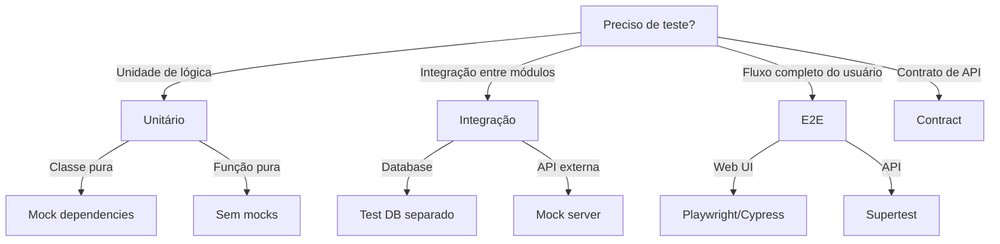

# Testing

Guia para escrita de testes automatizados robustos.

## Quando Usar

### Use quando:
- Precisa escrever testes para nova funcionalidade
- Quer aumentar cobertura de testes existente
- Precisa definir estratégia de testes para projeto
- Quer padronizar testes entre equipes
- Precisa revisar qualidade de testes

### Não use quando:
- Trabalhando em script muito simples (protótipo)
- Projeto sem suporte a testes automatizados
- Precisa de teste manual (UI/UX)

### Skills relacionadas:
- `ddd` — para testar agregados e entidades de domínio
- `governance` — para políticas de coverage mínima

## Decision Tree



## Workflow

### Fase 1: Escrever Teste Unitário

1. Identifique a unidade a ser testada (classe, função, método)
2. Crie arquivo de teste ao lado do código fonte:
   ```bash
   # Estrutura
   src/
   ├── services/
   │   ├── user-service.ts
   │   └── user-service.test.ts
   ```
3. Use o template `templates/unit-test.ts`:
   ```bash
   cp templates/unit-test.ts src/services/user-service.test.ts
   ```
4. Preencha os placeholders do template
5. Execute o teste:
   ```bash
   npm test -- user-service.test.ts
   ```
6. **Checkpoint**: Teste passa e cobre caminho feliz

### Fase 2: Escrever Teste de Integração

1. Identifique o ponto de integração (database, API, serviço externo)
2. Configure ambiente de teste:
   ```bash
   # docker-compose.test.yml
   services:
     postgres:
       image: postgres:15
       environment:
         POSTGRES_DB: test_db
   ```
3. Use o template `templates/integration-test.ts`
4. Configure setup/teardown no `beforeAll`/`afterAll`
5. Execute testes:
   ```bash
   npm run test:integration
   ```
6. **Checkpoint**: Teste passa e verifica persistência

### Fase 3: Escrever Teste E2E

1. Identifique o fluxo crítico do usuário
2. Configure ambiente E2E:
   ```bash
   # .env.test
   BASE_URL=http://localhost:3000
   ```
3. Use o template `templates/e2e-test.ts`
4. Adicione `data-testid` aos elementos UI:
   ```html
   <button data-testid="submit-button">Submit</button>
   ```
5. Execute teste:
   ```bash
   npm run test:e2e
   ```
6. **Checkpoint**: Fluxo completo funciona

### Fase 4: Analisar Cobertura

1. Execute testes com coverage:
   ```bash
   npm run test:coverage
   ```
2. Abra relatório:
   ```bash
   open coverage/lcov-report/index.html
   ```
3. Identifique áreas sem cobertura
4. Crie plano de cobertura:
   ```bash
   cp templates/test-plan.md docs/test-plan.md
   ```
5. **Checkpoint**: Coverage ≥ 80% para unidades

### Fase 5: Refatorar com Testes como Safety Net

1. Execute todos os testes antes de refatorar:
   ```bash
   npm test
   ```
2. Refatore código mantendo API pública
3. Execute testes após cada mudança:
   ```bash
   npm test
   ```
4. Se teste quebra, revert ou ajuste refatoração
5. **Checkpoint**: Todos os testes passam após refatoração

## Conceitos Fundamentais

### Pirâmide de Testes

```
         /\
        /  \      E2E (poucos, críticos)
       /____\
      /      \    Integração (médio)
     /________\
    /          \  Unitários (muitos)
   /____________\
```

### AAA Pattern

```typescript
it('should return total when items provided', () => {
  // Arrange - preparar dados
  const cart = new ShoppingCart();
  const item = { id: 1, price: 100 };
  
  // Act - executar ação
  cart.addItem(item);
  const total = cart.getTotal();
  
  // Assert - verificar resultado
  expect(total).toBe(100);
});
```

### Naming Convention

Padrão: `should [expected behavior] when [condition]`

```typescript
// ✅ CORRETO
it('should throw ValidationError when email is invalid')
it('should return user when id exists')
it('should calculate total when items provided')

// ❌ ERRADO
it('test user')
it('email validation')
it('works')
```

## Templates

### unit-test.ts
Localização: `templates/unit-test.ts`

Template para testes unitários com Vitest/Jest.

**Uso:**
```bash
cp templates/unit-test.ts src/{module}/{module}.test.ts
```

### integration-test.ts
Localização: `templates/integration-test.ts`

Template para testes de integração com setup/teardown.

**Uso:**
```bash
cp templates/integration-test.ts test/integration/{module}.test.ts
```

### e2e-test.ts
Localização: `templates/e2e-test.ts`

Template para testes E2E com Playwright.

**Uso:**
```bash
cp templates/e2e-test.ts e2e/{flow}.spec.ts
```

### test-plan.md
Localização: `templates/test-plan.md`

Template para planejar cobertura de testes.

**Uso:**
```bash
cp templates/test-plan.md docs/test-plan.md
```

## Anti-patterns

### 🔴 Crítico

#### Test Leaky
**O que é:** Teste que depende de estado externo ou ordem de execução.
**Por que é ruim:** Testes passam/falham aleatoriamente, impossível debug.
**Como evitar:** Use setup/teardown, testes independentes.
**Exemplo:**
```typescript
// ❌ ERRADO - depende de banco real
it('should create user', () => {
  const user = userService.createUser({ name: 'John' });
  // espera que user.id seja 1 - pode falhar se outro teste rodou antes
  expect(user.id).toBe(1);
});

// ✅ CORRETO - isolado
it('should create user', async () => {
  await setupTestDatabase();
  const user = await userService.createUser({ name: 'John' });
  expect(user.id).toBeDefined();
  await teardownTestDatabase();
});
```

#### Mock Excessivo
**O que é:** Mockar tudo, incluindo código que deveria ser testado.
**Por que é ruim:** Teste não valida integração real, falso positivo.
**Como evitar:** Mock apenas dependências externas.
**Exemplo:**
```typescript
// ❌ ERRADO - mockando tudo
const result = await jest.fn().mockReturnValue('mocked');

// ✅ CORRETO - mockando apenas externo
const httpClient = new MockHttpClient();
const service = new UserService(httpClient);
```

### 🟡 Médio

#### Test Sem Assertion
**O que é:** Teste que não verifica nada.
**Por que é ruim:** Teste sempre passa, não detecta bugs.
**Como evitar:** Sempre use expect().
**Exemplo:**
```typescript
// ❌ ERRADO
it('should work', () => {
  userService.createUser({ name: 'John' });
});

// ✅ CORRETO
it('should create user successfully', () => {
  const user = userService.createUser({ name: 'John' });
  expect(user.id).toBeDefined();
  expect(user.name).toBe('John');
});
```

#### Test Frágil
**O que é:** Teste que quebra com mudanças não relacionadas.
**Por que é ruim:** Alto custo de manutenção.
**Como evitar:** Use seletores estáveis, teste comportamento não implementação.
**Exemplo:**
```typescript
// ❌ ERRADO - usa classe CSS que muda
await page.click('.btn-primary');

// ✅ CORRETO - usa data-testid estável
await page.click('[data-testid="submit-button"]');
```

### 🟢 Baixo

#### Test com Lógica
**O que é:** Teste que contém lógica condicional ou loops.
**Por que é ruim:** Teste difícil de entender, pode ter bugs.
**Como evitar:** Teste uma coisa, sem lógica.
**Exemplo:**
```typescript
// ❌ ERRADO
it('should validate users', () => {
  users.forEach(user => {
    if (user.age > 18) {
      expect(validate(user)).toBe(true);
    }
  });
});

// ✅ CORRETO
it('should validate adult user', () => {
  const user = { name: 'John', age: 25 };
  expect(validate(user)).toBe(true);
});

it('should reject minor user', () => {
  const user = { name: 'Jane', age: 15 };
  expect(validate(user)).toBe(false);
});
```

## Checklists

### Checklist de Review de Teste
- [ ] Segue padrão AAA (Arrange, Act, Assert)
- [ ] Nome claro seguindo `should X when Y`
- [ ] Um conceito por teste
- [ ] Teste caminho feliz
- [ ] Teste caminhos de erro
- [ ] Teste edge cases
- [ ] Mocks apenas para dependências externas
- [ ] Não tem lógica no teste

### Checklist de Coverage
- [ ] Coverage ≥ 80% para unidades
- [ ] Coverage ≥ 70% para integração
- [ ] Coverage ≥ 60% para E2E
- [ ] Nenhum arquivo com < 50% coverage
- [ ] Nenhum branch não coberto
- [ ] Nenhum path não coberto

### Checklist de CI
- [ ] Testes rodam em CI
- [ ] Coverage é reportado
- [ ] Build falha se coverage < meta
- [ ] Testes paralelos habilitados
- [ ] Cache de dependências configurado

## Edge Cases

### Teste Dependente de Ordem
**Situação:** Teste A passa apenas se executado antes do Teste B.
**Solução:** Use `beforeEach`/`afterEach` para isolar estado.
**Exceção:** Testes de migração de banco podem precisar de ordem.

```typescript
// Isolar estado entre testes
beforeEach(() => {
  jest.clearAllMocks();
  testDb.clear();
});
```

### Flaky Test
**Situação:** Teste que passa/falha aleatoriamente.
**Solução:** Identifique causa (timing, estado compartilhado, rede) e isole.
**Exceção:** Testes com `setTimeout` para debounce podem ser flaky.

```typescript
// ❌ Pode ser flaky
await button.click();
expect(element).toBeVisible(); // timing issue

// ✅ Mais estável
await button.click();
await page.waitForSelector('[data-testid="element"]', { state: 'visible' });
expect(element).toBeVisible();
```

### Teste com I/O Externo
**Situação:** Teste faz chamada real a API externa.
**Solução:** Use mock server (MSW, nock) ou fixtures.
**Exceção:** Testes de contrato podem precisar de I/O real.

```typescript
// Usar MSW para mockar API
import { setupServer } from 'msw/node';
const server = setupServer(
  rest.get('/api/users', (req, res, ctx) => {
    return res(ctx.json([{ id: 1, name: 'John' }]));
  })
);
```

## Referências

- [Testing Library](https://testing-library.com/)
- [Vitest](https://vitest.dev/)
- [Playwright](https://playwright.dev/)
- `ddd` — para testar agregados
- `governance` — para políticas de CI/CD