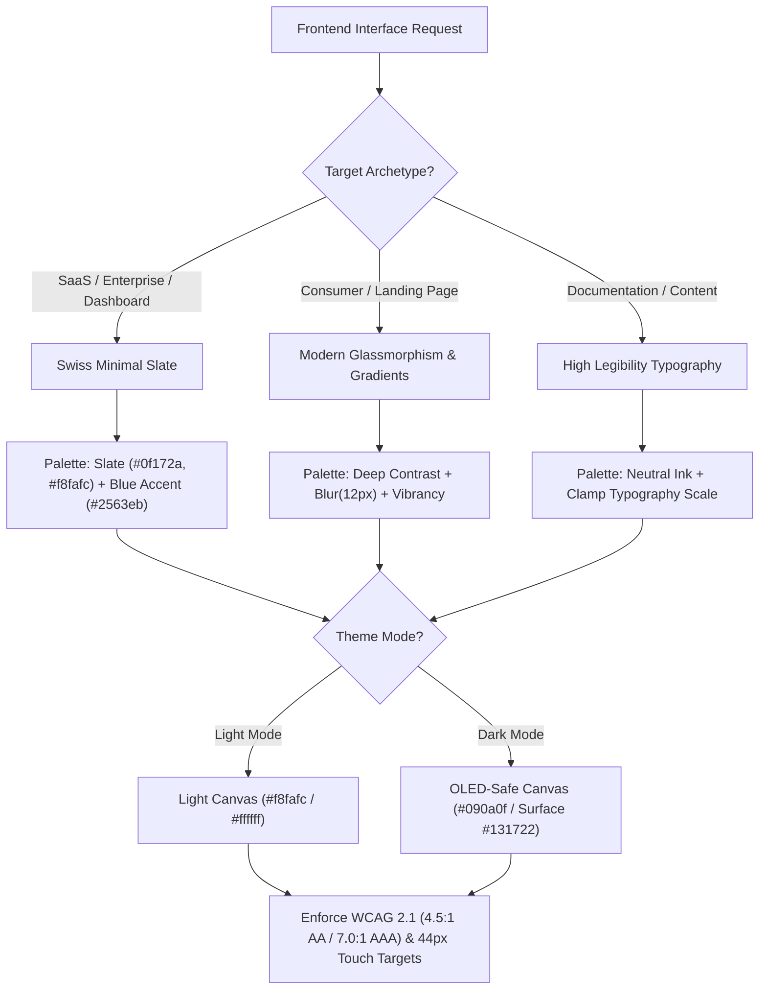

# UI/UX Pro Max Engine (v3.0.0 SOTA Edition)

Authoritative visual engineering engine, design tokens system, and UX heuristics suite for web applications, dashboards, landing pages, and component design.

> 💡 **Lazy Loading of References:** This document contains non-negotiable visual hierarchy rules, accessibility standards, and design heuristics. To consult the complete catalog of CSS custom properties, hexadecimal palettes, and component snippets, execute `view_file` on [`references/design-tokens-and-palettes.md`](./references/design-tokens-and-palettes.md).

---

## When to Use

### Use When:
- Designing or implementing frontend user interfaces, components, design systems, or layouts.
- Styling applications with modern CSS tokens, typography scales, glassmorphism, or dark mode.
- Auditing and enforcing WCAG 2.1 AA/AAA accessibility and Apple HIG touch target compliance.
- Establishing micro-interactions, form validation heuristics, and visual feedback timings.

### Do Not Use When:
- Building pure backend APIs, databases, or command-line tools without graphical interfaces.
- Conducting exploratory user research interviews or user persona definition (use `ux-researcher-designer`).
- Designing platform-native iOS/Android applications with Swift/Kotlin/React Native (use `mobile-design`).
- Creating standalone single-file HTML/JS prototyping artifacts from scratch (use `artifacts-builder`).

### Related Skills:
- `artifacts-builder` — builds single-file interactive demos and prototypes.
- `mobile-design` — mobile-specific patterns (HIG/Material) and touch ergonomics.
- `ux-researcher-designer` — user research methodologies, personas, and usability testing.
- `clean-code` — code-level structure and frontend maintainability.

---

## Visual Hierarchy Priorities (Non-Negotiable Order)

Never invert or skip this hierarchy. Aesthetic never supersedes usability and performance:

```
┌────────────────────────────────────────────────────────┐
│ 1. ACCESSIBILITY (WCAG 2.1 AA/AAA)                   │
├────────────────────────────────────────────────────────┤
│ 2. TOUCH TARGETS (44x44px Minimum Apple HIG / WCAG)     │
├────────────────────────────────────────────────────────┤
│ 3. PERFORMANCE (LCP < 2.5s, CLS < 0.1, INP < 200ms)    │
├────────────────────────────────────────────────────────┤
│ 4. STYLE & DESIGN SYSTEM (Glassmorphism, Minimal, etc)│
├────────────────────────────────────────────────────────┤
│ 5. LAYOUT & COMPOSITION (8pt Grid, Micro-animations)   │
└────────────────────────────────────────────────────────┘
```

---

## Decision Tree — Archetype & Style Selection



---

## UI/UX Engineering Phases (3-Phase Process)

### Phase 1: Viewport & Responsive Breakpoints
- **Mobile First**: 375px (Compact touch viewport, single column, sticky actions).
- **Tablet**: 768px (Fluid grid transitions, adaptive navbars).
- **Desktop**: 1280px+ (Max container constraint 1440px, high density grids).

### Phase 2: Selection of Style & Semantic Tokens
- **SaaS / Enterprise**: Swiss Design, Minimal Slate, 8pt Grid spacing, high data density.
- **Consumer / Landing Pages**: Smooth Glassmorphism (`backdrop-filter: blur(12px)`), curated typography (Inter, Outfit, Geist), subtle micro-animations.
- Consult [`references/design-tokens-and-palettes.md`](./references/design-tokens-and-palettes.md) for ready-to-use CSS tokens.

### Phase 3: Interaction Heuristics & Form Validation
- **Miller's Law**: Maximum of 7 (±2) items in primary navigation bars.
- **Visible Labels**: Always position labels above inputs; never substitute labels with placeholders.
- **Form Validation**: Trigger inline validation exclusively on the `blur` event (never on `keystroke` / `input`).
- **Visual Feedback Timing**:
  - Actions > 300ms: Display loading skeleton / spinner.
  - Success notifications: Auto-dismiss toast in 3 seconds.
  - Error notifications: Persistent toast with explicit dismiss and retry action.

---

## Dark Mode & OLED-Safe Contrast Rules

1. **Never Invert Pure Colors**: Remap to deep tones (`#090a0f` canvas / `#131722` surface).
2. **Elevation by Illumination**: In dark mode, elevated surfaces use lighter slate tones (`#1e293b`), not darker black shadows.
3. **Color Desaturation**: Reduce primary accent color saturation by 15–20% against dark backgrounds to eliminate optical vibration and eye fatigue.

---

## Anti-patterns

### 🔴 Critical

#### WCAG Contrast Failures
- **What is it:** Using light gray text (#94a3b8) on white backgrounds or low-contrast button states.
- **Why is it bad:** Fails WCAG 2.1 AA/AAA compliance and renders content unreadable.
- **How to avoid:** Enforce minimum 4.5:1 for normal text and 3.0:1 for large text.

#### Touch Targets Under 44x44px
- **What is it:** Creating tiny clickable icons or buttons (<44px).
- **Why is it bad:** Causes tap frustration and misses mobile accessibility benchmarks.
- **How to avoid:** Add `min-width: 44px; min-height: 44px;` or use padding to expand the target area.

#### Substituting Form Labels with Placeholders
- **What is it:** Omitting `<label>` and relying solely on `placeholder="..."`.
- **Why is it bad:** Placeholders disappear once the user types, destroying user context and screen reader navigation.
- **How to avoid:** Always render persistent labels above input fields.

### 🟡 Medium

#### Keystroke-Level Validation Spam
- **What is it:** Displaying "Invalid email" error on the first typed character.
- **How to avoid:** Validate only when the user exits the field (`onBlur`).

#### Pure Black #000000 Backgrounds
- **What is it:** Using `#000000` for all dark mode backgrounds.
- **How to avoid:** Use deep slate `#090a0f` for canvas and `#131722` for surfaces to maintain soft contrast.

---

## UI/UX Delivery Verification Checklist

- [ ] **Accessibility**: Normal text contrast ≥ 4.5:1 (AA) / 7.0:1 (AAA).
- [ ] **Touch Targets**: All interactive elements have ≥ 44x44px target area.
- [ ] **Focus States**: Visible focus indicator present (`focus-visible: ring-2 ring-offset-2`).
- [ ] **Responsive**: Verified across 375px (Mobile), 768px (Tablet), and 1280px+ (Desktop).
- [ ] **Forms**: Labels positioned above inputs; validation on `blur`.
- [ ] **Dark Mode**: Elevation by illumination applied, desaturated accent colors.

## Edge Cases & Failure Modes

- **Restricted / Read-Only Environment:** If the filesystem or sandbox is write-locked, report the constraint immediately with evidence and generate changes as a markdown diff patch.
- **Specification Conflict:** If contradictions emerge between user intent and the SSOT (`AGENTS.md`), halt and present trade-off options.
- **Context Exhaustion / Timeout:** For massive tasks, decompose into atomic sub-batches utilizing `subagent-driven-development`.


## Domain SOTA & Industry Engineering Standards

- **Accessibility & Contrast:** WCAG 2.2 AAA compliance, Relative Luminance mathematics ($C_{\text{ratio}} \ge 7:1$), and APCA (Accessible Perceptual Contrast Algorithm).
- **Modern Layout Engines:** CSS Grid Level 2 (Subgrid), Container Queries (`@container`), and CSS Anchor Positioning.
- **Design Tokens & Systems:** HSL tailored palettes, 8pt spatial grid, fluid typography with `clamp()`, and glassmorphism backdrop filters.
- **Micro-Interactions & Motion:** View Transitions API, CSS scroll-driven animations, and reduced-motion media queries (`prefers-reduced-motion: reduce`).

### WCAG 2.2 Luminance & Contrast Formula:

$$\text{Contrast Ratio} = \frac{L_1 + 0.05}{L_2 + 0.05} \quad \text{where } L_1 > L_2$$

| Compliance Level | Normal Text ($<18\text{pt}$) | Large Text ($\ge 18\text{pt}$ / $24\text{px}$) | UI Components / Icons |
|:---|:---:|:---:|:---:|
| **WCAG AA** | $\ge 4.5:1$ | $\ge 3.0:1$ | $\ge 3.0:1$ |
| **WCAG AAA (Enhanced SOTA)** | $\ge 7.0:1$ | $\ge 4.5:1$ | $\ge 4.5:1$ |

### Fluid Typography Clamp Equation:
`font-size: clamp(1rem, 0.75rem + 1.25vw, 1.75rem);`

### Exhaustive Heuristic Decision Rules:
1. **Rule of Thumb 1 (WCAG 2.2 Contrast Mandate):** Body text must achieve at least $4.5:1$ (AA) and preferably $7.0:1$ (AAA) against its direct background color.
2. **Rule of Thumb 2 (Reduced Motion Invariant):** All CSS animations and smooth scrolls must provide a zero-animation fallback under `@media (prefers-reduced-motion: reduce)`.
3. **Rule of Thumb 3 (Subgrid Alignment):** Card lists and form rows with multi-column alignment must use CSS Subgrid to prevent visual misalignment.
4. **Rule of Thumb 4 (Keyboard Navigability):** All interactive elements must have visible, high-contrast focus rings (`:focus-visible`).

## Completion Gate

The task associated with the skill `ui-ux-pro-max` can only be declared complete when:
1. All checks in the operational verification checklist have been satisfied.
2. The deliverable has been deterministically validated through execution evidence.
3. No structural debt, unresolved placeholders, or unhandled errors remain.

