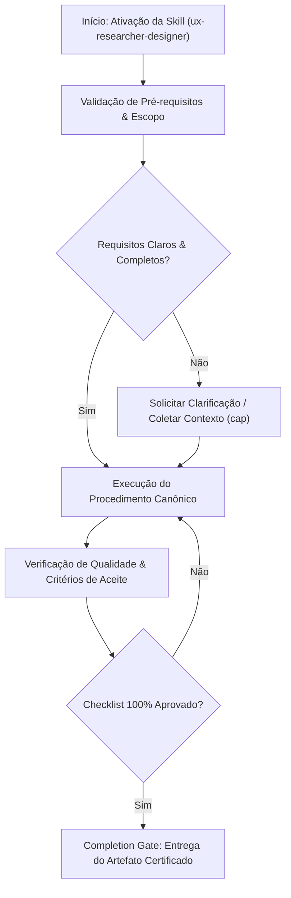

# UX Researcher & Designer

## When to Use

### Use when:
- Planning usability testing protocols, user interviews, and field studies
- Calculating empirical usability metrics (System Usability Scale - SUS)
- Conducting heuristic evaluations against Nielsen Norman Group standards

### Do not use when:
- Writing low-level frontend code or implementing CSS styles directly

## Overview

Apply systematic UX research and design methods to understand users, validate assumptions, and create evidence-based designs. This skill covers the full research-to-design pipeline: discovery research, persona creation, journey mapping, information architecture, usability testing, and heuristic evaluation.

## Phase 1: Discovery Research

1. Define research objectives and questions
2. Select appropriate research methods
3. Recruit participants (5-8 per segment for qualitative)
4. Conduct research sessions
5. Synthesize findings using affinity mapping

**STOP — Present research plan with objectives and methods for user approval.**

### Research Method Selection Decision Table

#### Generative (Discovery) Methods

| Method | When to Use | Participants | Duration | Cost |
|---|---|---|---|---|
| User Interviews | Understanding motivations, behaviors, pain points | 5-8 per segment | 45-60 min each | Medium |
| Contextual Inquiry | Observing users in their natural environment | 4-6 | 1-2 hours each | High |
| Diary Studies | Longitudinal behavior patterns | 10-15 | 1-4 weeks | Medium |
| Surveys | Quantitative validation of qualitative findings | 100+ | 5-10 min | Low |
| Focus Groups | Exploring attitudes and preferences | 6-10 per group | 60-90 min | Medium |

#### Evaluative Methods

| Method | When to Use | Participants | Duration | Cost |
|---|---|---|---|---|
| Usability Testing | Validating designs against tasks | 5-8 | 30-60 min each | Medium |
| A/B Testing | Comparing two design variants | 1000+ per variant | 1-4 weeks | Low |
| Card Sorting | Organizing information architecture | 15-30 | 20-30 min | Low |
| Tree Testing | Validating navigation structure | 50+ | 10-15 min | Low |
| First Click Testing | Evaluating initial user instincts | 30+ | 5-10 min | Low |
| Heuristic Evaluation | Expert review without users | 3-5 evaluators | 1-2 hours | Low |

#### Method Selection Decision Table

| Situation | Recommended Method | Why |
|---|---|---|
| No idea who users are | Interviews + contextual inquiry | Deep understanding needed |
| Have assumptions to validate | Surveys + usability testing | Quantitative confirmation |
| Redesigning navigation | Card sorting + tree testing | Structure-focused |
| Evaluating existing product | Heuristic evaluation + usability test | Find problems fast |
| Comparing two designs | A/B testing | Statistical comparison |
| Limited budget/time | Heuristic evaluation | No participants needed |
| Long-term behavior understanding | Diary study | Captures patterns over time |

### Interview Guide Template

```
1. Introduction (5 min)
   - Thank participant, explain purpose
   - Get consent for recording
   - "There are no wrong answers"

2. Warm-up (5 min)
   - Background questions about role/context
   - Current tools and workflows

3. Core Questions (30 min)
   - Open-ended questions about behaviors
   - Follow-up probes: "Tell me more about..."
   - Critical incident: "Describe a time when..."
   - Avoid leading questions

4. Wrap-up (5 min)
   - "Is there anything I didn't ask that you think is important?"
   - Thank and explain next steps
```

## Phase 2: Analysis and Modeling

1. Create user personas from research data
2. Map user journey for key scenarios
3. Define information architecture
4. Identify pain points and opportunities
5. Prioritize using impact/effort matrix

**STOP — Present personas and journey map for review before design validation.**

### Persona Template

```markdown
# [Persona Name]

## Demographics
- Age: [range]
- Occupation: [role]
- Technical proficiency: [low/medium/high]
- Usage frequency: [daily/weekly/monthly]

## Goals
1. Primary goal: [what they are trying to achieve]
2. Secondary goal: [supporting objective]
3. Tertiary goal: [nice-to-have]

## Pain Points
1. [Frustration with current process]
2. [Unmet need]
3. [Workaround they have created]

## Behaviors
- [How they currently solve the problem]
- [Tools and methods they use]
- [Decision-making patterns]

## Quotes (from research)
- "[Verbatim quote that captures their perspective]"
- "[Another representative quote]"

## Scenario
[A paragraph describing a typical day/task where they would use the product]
```

### Persona Quality Decision Table

| Check | Pass | Fail |
|---|---|---|
| Based on real research data | Quotes and behaviors from interviews | Invented or assumed behaviors |
| Actionable for design | Specific goals and pain points | Vague "wants to be productive" |
| Distinct from other personas | Different goals, behaviors, constraints | Overlapping with another persona |
| Number of personas | 2-4 primary | More than 5 (too many to design for) |

### Journey Map Structure

```
Stages:     Awareness -> Consideration -> Onboarding -> Usage -> Advocacy
                |              |             |          |          |
Actions:   [What they do at each stage]
                |              |             |          |          |
Thoughts:  [What they are thinking]
                |              |             |          |          |
Emotions:  [Frustration/neutral/delight mapped to each stage]
                |              |             |          |          |
Pain Points: [Friction and frustration points]
                |              |             |          |          |
Opportunities: [Design opportunities to improve]
                |              |             |          |          |
Touchpoints: [Channels and interfaces involved]
```

### Journey Map Elements

- **Moments of Truth**: Critical points where users form lasting impressions
- **Service Blueprints**: Front-stage actions mapped to back-stage processes
- **Emotion Curve**: Visual line showing emotional highs and lows
- **Gap Analysis**: Difference between current and desired experience

### Heuristic Evaluation (Nielsen's 10)

| # | Heuristic | What to Look For |
|---|---|---|
| 1 | Visibility of system status | Loading indicators, progress bars, save confirmations |
| 2 | Match with real world | Natural language, familiar metaphors, logical order |
| 3 | User control and freedom | Undo, cancel, back, escape hatches |
| 4 | Consistency and standards | Same action = same result, platform conventions |
| 5 | Error prevention | Confirmation dialogs, constraints, smart defaults |
| 6 | Recognition over recall | Visible options, contextual help, recent history |
| 7 | Flexibility and efficiency | Shortcuts, customization, bulk actions |
| 8 | Aesthetic and minimalist design | No unnecessary information, clear hierarchy |
| 9 | Help users with errors | Plain language errors, specific cause, suggest fix |
| 10 | Help and documentation | Searchable, task-oriented, concise |

### Severity Rating Scale

| Rating | Description | Action |
|---|---|---|
| 0 | Not a usability problem | No action |
| 1 | Cosmetic only | Fix if time allows |
| 2 | Minor problem | Low priority fix |
| 3 | Major problem | High priority, fix before launch |
| 4 | Usability catastrophe | Must fix immediately |

## Phase 3: Design Validation

1. Create testable prototypes (low or high fidelity)
2. Plan usability testing sessions
3. Conduct tests with 5+ participants
4. Analyze results and iterate
5. Document findings and recommendations

**STOP — Present usability test results and recommendations for review.**

### Prototype Fidelity Decision Table

| Situation | Fidelity | Tool | Why |
|---|---|---|---|
| Early concept validation | Low (paper/wireframe) | Balsamiq, paper | Fast iteration, low commitment |
| Navigation testing | Medium (clickable) | Figma prototype | Test flow without visual polish |
| Visual design validation | High (pixel-perfect) | Figma, coded prototype | Test actual look and feel |
| Interaction validation | High (coded) | HTML/CSS/JS prototype | Test real interactions |

### A/B Testing Methodology

| Step | Details |
|---|---|
| Hypothesis | "Changing [X] will [improve/decrease] [metric] because [reason]" |
| Sample size | Power analysis (95% confidence, 80% power) |
| Duration | Minimum 2 full business cycles (2+ weeks) |
| Variable control | Test one change at a time |
| Analysis | Statistical significance (p < 0.05) |

### Common UX Metrics

| Metric | What It Measures | Benchmark |
|---|---|---|
| Task success rate | % completing target task | > 78% (acceptable) |
| Time on task | Duration to complete action | Varies by task |
| Error rate | Mistakes per task | < 10% |
| System Usability Scale (SUS) | Overall usability score | 68 = average |
| Net Promoter Score (NPS) | Likelihood to recommend | > 0 = good, > 50 = excellent |
| Customer Effort Score (CES) | Ease of experience | > 5/7 |

### Information Architecture

#### Card Sort Analysis Decision Table

| Sort Type | When to Use | Analysis Method |
|---|---|---|
| Open sort | Discovery — users create categories | Similarity matrix, dendrogram |
| Closed sort | Validation — sort into predefined categories | Category agreement percentage |
| Hybrid sort | Both — predefined with ability to add new | Combined analysis |

#### Navigation Patterns

| Pattern | Use Case |
|---|---|
| Global navigation | Persistent across all pages |
| Local navigation | Within a section |
| Contextual navigation | Related content links |
| Utility navigation | Settings, account, help |
| Breadcrumbs | Location within hierarchy |

## Deliverables Checklist

- [ ] Research plan with objectives and methods
- [ ] Participant recruitment screener
- [ ] Interview/test script
- [ ] Affinity map of findings
- [ ] Personas (2-4 primary)
- [ ] Journey map for key scenario
- [ ] Information architecture diagram
- [ ] Usability test report with severity ratings
- [ ] Prioritized recommendations with evidence

## Anti-Patterns / Common Mistakes

| Anti-Pattern | Why It Is Wrong | What to Do Instead |
|---|---|---|
| Designing without research | Assumptions lead to wrong designs | Start with discovery research |
| Testing with colleagues | Biased, know too much about product | Recruit external participants |
| Asking users what they want | Users cannot predict behavior | Observe what they do instead |
| Confirmation bias | Only seeing what supports beliefs | Use structured analysis, multiple evaluators |
| Too many personas (5+) | Cannot design for everyone | Keep to 2-4 primary personas |
| Skipping synthesis | Raw data is not insights | Always do affinity mapping |
| Underpowered A/B tests | Results are meaningless noise | Calculate sample size before starting |
| Presenting findings without recommendations | Research without action is wasted | Always include prioritized next steps |

## Integration Points

| Skill | Integration |
|---|---|
| `ui-ux-pro-max` | UX guidelines and design patterns |
| `mobile-design` | Mobile usability testing patterns |
| `planning` | Research plan is part of the implementation plan |
| `spec-writing` | User research informs JTBD specifications |
| `prd-generation` | Personas and journey maps feed into PRDs |
| `llm-as-judge` | Evaluate design quality with rubrics |

## Skill Type

**FLEXIBLE** — Select and combine research methods based on project constraints (budget, timeline, access to users). Lightweight methods (heuristic evaluation, guerrilla testing) are acceptable when full research is impractical.


## Decision Workflow




## Anti-Patterns & Operational Guardrails

| Anti-Pattern | Severidade | Impacto Negativo | Mitigação Canônica |
|:---|:---:|:---|:---|
| **Premature Execution Without Context** | 🔴 Critical | Context hallucination and destructive refactoring | Activate `cap` to acquire minimal evidence before editing. |
| **Omission of Validation Checklists** | 🟡 Medium | Delivering artifacts with syntax inconsistencies | Rigorously execute the checklist step-by-step before handoff. |
| **Falta de Documentação de Decisões** | 🟢 Low | Perda de rastreabilidade técnica e drift arquitetural | Registrar trade-offs relevantes via skill `adr-generator`. |


## Edge Cases & Failure Modes

- **Restricted / Read-Only Environment:** If the filesystem or sandbox is write-locked, report the constraint immediately with evidence and generate changes as a markdown diff patch.
- **Specification Conflict:** If contradictions emerge between user intent and the SSOT (`AGENTS.md`), halt and present trade-off options.
- **Context Exhaustion / Timeout:** For massive tasks, decompose into atomic sub-batches utilizing `subagent-driven-development`.


## Domain SOTA & Industry Engineering Standards

- **Empirical Usability Metrics:** System Usability Scale (SUS), Single Ease Question (SEQ), and Task Completion Rate ($TCR \ge 85\%$).
- **Heuristic Evaluation:** Jakob Nielsen's 10 Usability Heuristics and Severity Rating (0 to 4).
- **Discovery Frameworks:** Jobs-to-be-Done (JTBD) Outcome-Driven Innovation and Double Diamond user discovery.
- **Information Architecture:** Tree Testing, Open/Closed Card Sorting, and User Journey Mapping.

### System Usability Scale (SUS) Score Equation:

$$\text{SUS} = 2.5 \times \left( \sum_{i \in \text{Odd}} (R_i - 1) + \sum_{j \in \text{Even}} (5 - R_j) \right) \in [0, 100]$$

| SUS Score Range | Grade | Usability Quality |
|:---|:---:|:---|
| **$\ge 80.3$** | **A** | World-Class / Highly Delightful |
| **$68.0 \le \text{SUS} < 80.3$** | **B / C** | Industry Average / Acceptable |
| **$< 68.0$** | **D / F** | Deficient / Critical Usability Friction |

### Exhaustive Heuristic Decision Rules:
- **Rule of Thumb 1 (Zero-Trust Architectural Boundaries):** Treat all external inputs, third-party payloads, and cross-module boundaries with strict zero-trust schema validation.
- **Rule of Thumb 2 (Fail-Fast & Deterministic Errors):** Reject invalid states immediately with typed, actionable error contracts rather than cascading silent failures.
- **Rule of Thumb 3 (Idempotency & AST Preservation):** State mutations and code transformations must maintain semantic idempotency across repeated executions.
- **Rule of Thumb 4 (Benchmark & Telemetry Alignment):** Measure critical execution latency ($P_{95}$) and memory overhead with structured telemetry and baseline benchmarks.
- **Rule of Thumb 5 (Event-Driven & Circuit Breaker Decoupling):** Isolate asynchronous operations behind circuit breakers and resilient retry mechanisms to prevent cascading failure.
- **Rule of Thumb 6 (Contract-First DDD Modeling):** Define clear domain aggregates, value objects, and typed interface contracts before implementing concrete logic.
- **Rule of Thumb 7 (RAG & Semantic Retrieval Precision):** Optimize context retrieval with hybrid lexical-vector search and reciprocal rank fusion to eliminate hallucinated routing.
- **Rule of Thumb 8 (OWASP & Supply Chain Verification):** Verify dependencies and data flows against OWASP Top 10 and SLSA Level 3 supply chain security standards.
- **Rule of Thumb 9 (Verification Gate Invariant):** Never declare completion without automated test execution evidence and zero compiler/linter warnings.
## Completion Gate & Verification
Before concluding UX research study:
- [ ] SUS score calculated with sample size $\ge 5$ users
- [ ] Usability friction points mapped with severity ratings (0 to 4)
- [ ] Actionable design recommendations presented to product team