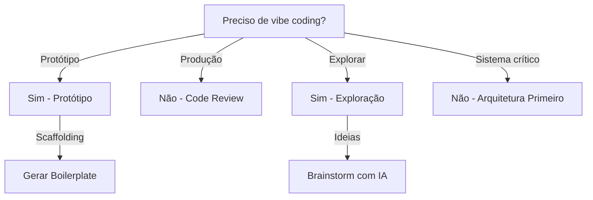

# Vibe Coding

Desenvolvimento orientado por intenção com agentes de IA.

## Quando Usar

### Use quando:
- Desenvolvimento rápido de protótipos
- Exploração de soluções
- Pair programming com IA
- Geração de scaffolding inicial
- Refatorar código existente

### Não use quando:
- Código de produção sem revisão
- Sistemas críticos sem testes
- Decisões arquiteturais sem compreensão
- Segredos/credenciais em prompts

### Skills relacionadas:
- `prompt-engineering` — para criar prompts eficazes
- `testing` — para validar código gerado

## Decision Tree



## Workflow

### Fase 1: Briefing → Refinamento → Validação → Ajuste

1. **Briefing** - Descreva intenção:
   ```
   Quero uma API de pedidos com:
   - CRUD de produtos
   - Carrinho de compras
   - Checkout com cálculo de frete
   ```
2. **Refinamento** - Ajuste detalhes:
   ```
   Agora adicione validação de estoque no checkout
   ```
3. **Validação** - Verifique resultado:
   ```
   Rode os testes e mostre o resultado
   ```
4. **Ajuste** - Corrija problemas:
   ```
   O cálculo de frete está errado para peso > 10kg. Corrija.
   ```
5. **Checkpoint**: Código funciona conforme intenção

### Fase 2: Gerar Scaffolding com IA

1. Descreva estrutura desejada:
   ```
   Crie estrutura de projeto Node.js com:
   - Clean Architecture
   - TypeScript
   - Express
   - Prisma
   ```
2. Peça para IA gerar:
   ```
   Gere todos os arquivos necessários
   ```
3. Revise estrutura gerada:
   ```bash
   tree src/
   ```
4. **Checkpoint**: Estrutura pronta para desenvolvimento

### Fase 3: Refatorar com IA como Copiloto

1. Mostre código atual:
   ```
   Refatore este código para usar Repository Pattern:
   {código atual}
   ```
2. Peça explicação:
   ```
   Explique as mudanças e por que são melhores
   ```
3. Aplique mudanças:
   ```
   Aplique as mudanças sugeridas
   ```
4. **Checkpoint**: Código refatorado e testado

## Conceitos Fundamentais

### Intenção sobre Implementação

Descreva o que quer, não como fazer.

```
# ✅ MELHOR
"Quero API de autenticação com JWT"

# ❌ PIOR
"Use jsonwebtoken, crie middleware, adicione bcrypt..."
```

### Feedback Rápido

Iterações curtas, validação constante.

```
1. Gerar código
2. Testar
3. Ajustar
4. Repetir
```

### Confie, mas Verifique

Revise o código gerado.

```
- Teste manual
- Execute testes automatizados
- Verifique segurança
- Code review
```

### Contexto é Tudo

Quanto mais contexto, melhor o resultado.

```
- Stack atual
- Estrutura do projeto
- Padrões usados
- Restrições
```

## Templates

### vibe-session.md
Localização: `templates/vibe-session.md`

Template para sessão de vibe coding.

**Uso:**
```bash
cp templates/vibe-session.md docs/vibe-sessions/{session}.md
```

## Anti-patterns

### 🔴 Crítico

#### Confiar 100% na IA
**O que é:** Usar código gerado sem revisão.
**Por que é ruim:** Vulnerabilidades, bugs, código não testado.
**Como evitar:** Sempre revise, teste e valide.
**Exemplo:**
```
# ❌ ERRADO
IA gera código
git commit -m "feat: add auth"

# ✅ CORRETO
IA gera código
npm test
npm run lint
git commit -m "feat: add auth"
```

#### Prompt com Segredos
**O que é:** Incluir credenciais em prompts.
**Por que é ruim:** Exposição de segredos, segurança comprometida.
**Como evitar:** Use placeholders, nunca valores reais.
**Exemplo:**
```
# ❌ ERRADO
"Conecte ao banco com senha 'senha123'"

# ✅ CORRETO
"Conecte ao banco com variável de ambiente DATABASE_URL"
```

### 🟡 Médio

#### Não Revisar Código Gerado
**O que é:** Aceitar código sem verificar qualidade.
**Por que é ruim:** Código duplicado, padrões inconsistentes.
**Como evitar:** Code review sempre.
**Exemplo:**
```
# ❌ ERRADO
IA gera
git add .

# ✅ CORRETO
IA gera
# Review manual
# Executar testes
git add .
```

#### Prompts Vagos
**O que é:** Prompts sem contexto suficiente.
**Por que é ruim:** Output genérico, precisa de múltiplas tentativas.
**Como evitar:** Seja específico, inclua stack e restrições.
**Exemplo:**
```
# ❌ ERRADO
"Crie sistema de pagamento"

# ✅ CORRETO
"Crie API de pagamento com:
- Node.js + Express + TypeScript
- Clean Architecture
- Repository Pattern
- Endpoints: POST /payments, GET /payments/:id"
```

### 🟢 Baixo

#### Sessão sem Documentação
**O que é:** Sessão de vibe coding sem registro.
**Por que é ruim:** Decisões perdidas, dificuldade de replicar.
**Como evitar:** Documente decisões importantes.
**Exemplo:**
```markdown
# ✅ CORRETO
## Decisões
- Usado Repository Pattern para abstração
- Validação no domínio
- Testes com Vitest
```

## Checklists

### Checklist Pós-Sessão
- [ ] Código revisado manualmente
- [ ] Testes executados
- [ ] Lint passa
- [ ] Build funciona
- [ ] Documentação atualizada

### Checklist de Segurança
- [ ] Nenhuma credencial exposta
- [ ] Input validado
- [ ] SQL injection prevenida
- [ ] XSS prevenido
- [ ] Dependências verificadas

### Checklist de Coverage
- [ ] Testes unitários adicionados
- [ ] Coverage ≥ 80%
- [ ] Edge cases testados
- [ ] Error paths testados

## Edge Cases

### Código Gerado com Vulnerabilidades
**Situação:** IA gera código com falhas de segurança.
**Solução:** Use security scanner, corrija antes de commitar.
**Exceção:** Se vulnerabilidade é crítica, rejeite código.

```bash
npm audit
# Corrigir vulnerabilidades
npm audit fix
```

### Performance Degradada
**Situação:** Código gerado tem performance ruim.
**Solução:** Profile, identifique gargalo, otimize.
**Exceção:** Se performance é crítica, peça otimização.

```bash
# Profile
npm run dev -- --prof
```

### Dependências Obsoletas
**Situação:** IA sugere bibliotecas desatualizadas.
**Solução:** Verifique versões, use alternativas modernas.
**Exceção:** Se biblioteca é obrigatória, documente risco.

```bash
npm outdated
# Atualizar dependências
npm update
```

## Referências

- `prompt-engineering` — para prompts eficazes
- `testing` — para validar código