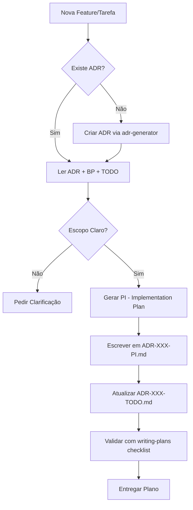

## Quando Usar

### Use quando:
- Tiver uma spec ou requisitos para uma task multi-step
- Precisar quebrar feature em tasks executáveis
- Criar roadmap técnico
- Planejar implementação antes de codificar

### Não use quando:
- Task for trivial (one-liner, bug fix óbvio)
- Já existir PI (Implementation Plan) para a ADR
- Não houver clareza sobre o que construir (peça clarificação)

### Skills relacionadas:
- `planning` — planejamento estratégico/tático
- `adr-generator` — criar ADR pré-requisito
- `implementation` — executar o plano gerado
- `testing` — estratégia de testes
- `governance` — compliance ADR→PI→TODO→Impl

---

# Decision Tree



---

## Workflow

## Fase 1: Contexto e Descoberta

1. Identificar ADR relacionada (ou criar via fallback)
2. Ler ADR, BP, TODO existentes
3. Entender:
   - Objetivo da feature
   - Constraints arquiteturais
   - Dependências existentes
   - Padrões do codebase

**Checkpoint:** [ ] ADR identificada [ ] Contexto compreendido [ ] Escopo definido

---

## Fase 2: Decomposição em Tasks

1. Quebrar feature em tasks atômicas (uma task = um commit)
2. Cada task deve ter:
   - Descrição clara
   - Arquivos a modificar
   - Critérios de aceite
   - Comando de validação
   - Testes esperados (TDD: teste primeiro)

**Checkpoint:** [ ] Tasks atômicas [ ] Cada task tem validação [ ] TDD considerado

---

## Fase 3: Escrita do PI (Implementation Plan)

Template: `templates/implementation-plan.md`

Estrutura obrigatória:
1. **Visão Geral** — Objetivo, ADR referência
2. **Tasks** — Lista ordenada com dependências
3. **Arquivos por Task** — Mapeamento task → arquivos
4. **Test Strategy** — Unit, Integration, E2E por task
5. **Rollback Plan** — Como reverter cada task
6. **Edge Cases** — Cenários excepcionais mapeados

**Checkpoint:** [ ] PI completo [ ] Tasks mapeadas [ ] Test strategy definida

---

## Fase 4: Atualização do TODO

1. Sincronizar `ADR-XXX-TODO.md` com tasks do PI
2. Usar cabeçalhos `## Fase 1`, `## Fase 2` para fases
3. Cada item: `- [ ] Descrição | Validação: \`comando\``

**Checkpoint:** [ ] TODO sincronizado [ ] Formato correto [ ] 1:1 com PI

---

## Fase 5: Validação e Entrega

1. Rodar checklist de qualidade
2. Apresentar plano ao usuário
3. Aguardar aprovação antes de implementar

**Checkpoint:** [ ] Checklist passado [ ] Usuário aprovou

---

## Conceitos Fundamentais

### Task Atômica
Uma task que:
- Produz um commit funcional
- Pode ser validada independentemente
- Tem rollback claro
- Segue TDD (teste escrito antes)

### Implementation Plan (PI)
Documento que transforma requisitos em tasks executáveis com:
- Mapeamento arquivo↔task
- Estratégia de teste
- Plano de rollback
- Edge cases

### Unified TODO
Único arquivo TODO por ADR, mapeando todas as fases via cabeçalhos markdown.

---

## Templates

### implementation-plan
Localização: `templates/implementation-plan.md`

Template para Implementation Plan (PI) Nível Enterprise.

**Uso:**
```bash
cp templates/implementation-plan.md docs/adr/ADR-XXX-PI.md
```

### task-card
Localização: `templates/task-card.md`

Template para task card individual.

**Uso:**
```bash
cp templates/task-card.md docs/adr/ADR-XXX-TASK-N.md
```

---

## Anti-patterns

### 🔴 Crítico

#### Plano sem ADR
**O que é:** Criar PI sem ADR aprovada.
**Por que é ruim:** Falta contexto, decisões não documentadas, governança quebrada.
**Como evitar:** Sempre seguir fallback — criar ADR primeiro.

#### Tasks Não-Atômicas
**O que é:** Tasks que exigem múltiplos commits ou não são independentemente validáveis.
**Por que é ruim:** Dificulta review, rollback, bisect, CI.
**Como evitar:** Uma task = um commit = uma validação.

#### Múltiplos TODOs
**O que é:** Criar `ADR-XXX-P2-TODO.md`, `ADR-XXX-Fase2-TODO.md`.
**Por que é ruim:** Quebra rastreabilidade 1:1, governance falha.
**Como evitar:** Usar cabeçalhos `## Fase N` em único `ADR-XXX-TODO.md`.

#### Ignorar TDD
**O que é:** Planejar implementação sem testes primeiros.
**Por que é ruim:** Bugs em produção, refatoração insegura, debt técnico.
**Como evitar:** Cada task tem "Teste:" antes de "Implementação:".

### 🟡 Médio

#### Plano Vago
**O que é:** Tasks sem arquivos específicos, validação genérica.
**Por que é ruim:** Engenheiro perdido, implementação inconsistente.
**Como evitar:** Especificar paths exatos, comandos exatos.

#### Sem Rollback Plan
**O que é:** Task sem estratégia de reversão.
**Por que é ruim:** Deploy arriscado, incidentes longos.
**Como evitar:** Documentar `git revert` ou migration down para cada task.

### 🟢 Baixo

#### Sem Edge Cases
**O que é:** Plano só cobre happy path.
**Por que é ruim:** Bugs em produção nos casos de borda.
**Como evitar:** Seção obrigatória "Edge Cases" no PI.

---

## Checklists

### Checklist de Qualidade do PI
- [ ] Referencia ADR válida
- [ ] Tasks atômicas (1 commit cada)
- [ ] Cada task tem: descrição, arquivos, validação, testes
- [ ] Test strategy: unit/integration/e2e por task
- [ ] Rollback plan por task
- [ ] Edge cases mapeados
- [ ] TODO sincronizado (formato 1:1)
- [ ] Sem tasks "genéricas" (ex: "implementar feature")

### Checklist de Entrega
- [ ] PI salvo em `docs/adr/ADR-XXX-PI.md`
- [ ] TODO atualizado em `docs/adr/ADR-XXX-TODO.md`
- [ ] Usuário revisou e aprovou
- [ ] Branch de trabalho criada (se aplicável)
- [ ] Próxima step: invocar skill `implementation`

---

## Edge Cases

### Tarefa Trivial (Sem ADR)
**Situação:** Bug fix óbvio, one-liner, sem impacto arquitetural.
**Solução:** Pular ADR, criar PI simplificado direto, documentar no commit.
**Exceção:** Se fix toca área sensível (auth, payments, infra), ADR obrigatória.

### Feature Gigante
**Situação:** Feature requer dezenas de tasks, múltiplas ADRs.
**Solução:** Desmembrar em sub-ADRs independentes, cada uma com seu PI/TODO.
**Exceção:** Se monolito inegável, usar fases no TODO único com cabeçalhos.

### Plano para Código Legado
**Situação:** Implementar em código sem testes, sem docs, sem patterns.
**Solução:** Incluir tasks de "Characterization Tests" antes de qualquer mudança.
**Exceção:** Nenhuma — regra de refactoring seguro.

---

## Referências

- `adr-generator` — Para criar ADR pré-requisito
- `implementation` — Para executar o plano gerado
- `testing` — Para test strategy
- `governance` — Para compliance ADR→PI→TODO→Impl
- [ADR-002](./docs/adr/archive/ADR-002.md) — Ultra-High Quality Grade