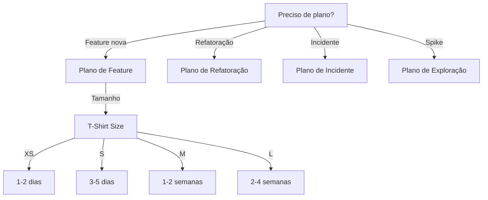

# Writing Plans

Gera planos de implementação estruturados e executáveis.

## Quando Usar

### Use quando:
- Precisa criar plano de implementação
- Precisa quebrar feature em tarefas
- Precisa estimar esforço
- Precisa priorizar backlog
- Precisa criar roadmap técnico

### Não use quando:
- Tarefa é imediata (< 1 hora)
- Protótipo rápido sem planejamento
- Bug fix simples
- **Precisa de roadmap estratégico ou priorização de portfólio → use `planning`**
- **Precisa de estimativa de esforço para iniciativa inteira → use `planning`**

### Skills relacionadas:
- `planning` — para priorização e estimativas
- `ddd` — para decompor domínio complexo

## Decision Tree



## Workflow

### Fase 1: Criar Plano de Implementação

1. Receba especificação do produto:
   ```
   Como usuário, quero login com Google para não lembrar senha
   ```
2. Decomponha em funcionalidades:
   - OAuth com Google
   - Callback handler
   - Criar/atualizar usuário
   - JWT token
3. Crie épico no plano:
   ```markdown
   ## Épico: Login Social com Google
   ```
4. Quebre em features:
   ```markdown
   ### Feature: OAuth Integration
   - [ ] Configurar Google OAuth
   - [ ] Implementar callback
   ```
5. Quebre em tasks:
   ```markdown
   #### Task: Configurar Google OAuth
   - [ ] Criar projeto no Google Console
   - [ ] Adicionar redirect URI
   - [ ] Salvar credenciais em .env
   ```
6. **Checkpoint**: Plano tem tasks com critérios de aceitação

### Fase 2: Estimar e Priorizar

1. Estime cada task:
   - **XS**: 1-2 horas
   - **S**: 1 dia
   - **M**: 3-5 dias
   - **L**: 1-2 semanas
2. Use MoSCoW para priorizar:
   - **Must**: obrigatório
   - **Should**: importante
   - **Could**: desejável
   - **Won't**: não agora
3. Use RICE para scoring:
   ```
   Score = (Reach × Impact × Confidence) / Effort
   ```
4. **Checkpoint**: Tasks estimadas e priorizadas

### Fase 3: Acompanhar Execução

1. Atualize status diariamente:
   ```markdown
   - [x] Task concluído
   - [~] Task em progresso (50%)
   - [ ] Task pendente
   ```
2. Identifique blockers:
   ```markdown
   ## Blockers
   - Task X bloqueado por Task Y
   ```
3. Replaneje se necessário:
   ```markdown
   ## Ajustes
   - Task Z dividida em Z1 e Z2
   ```
4. **Checkpoint**: Progresso visível, blockers resolvidos

### Fase 4: Validar Entrega

1. Verifique critérios de aceitação:
   - [ ] Todos os Must completos
   - [ ] Testes passam
   - [ ] Documentação atualizada
2. Faça demo:
   ```bash
   # Executar feature
   npm run dev
   ```
3. Atualize roadmap:
   ```markdown
   ## Concluído
   - [x] Login Social com Google
   ```
4. **Checkpoint**: Feature entregue e validada

## Conceitos Fundamentais

### Estrutura Hierárquica

#### Épico
Unidade grande de trabalho, múltiplas sprints.
- Alinhado a objetivo de negócio
- Entrega de valor mensurável

#### Feature
Conjunto de funcionalidades relacionadas, 1 sprint.
- Valor de negócio isolado
- Pode ser demonstrado

#### Task
Unidade mínima de trabalho, horas.
- Responsável único
- Critérios de aceitação claros

### Estimativas

#### T-Shirt Size
- **XS**: 1-2 horas
- **S**: 1 dia
- **M**: 3-5 dias
- **L**: 1-2 semanas
- **XL**: > 2 semanas (quebrar)

#### Planning Poker
Números de Fibonacci: 1, 2, 3, 5, 8, 13
- Use para consenso de equipe
- Discuta diferenças grandes

### Priorização

#### MoSCoW
- **Must**: obrigatório para a entrega
- **Should**: importante, mas não crítico
- **Could**: desejável, pode esperar
- **Won't**: não será feito agora

#### RICE
- **Reach**: quantos usuários afetados
- **Impact**: magnitude do impacto
- **Confidence**: certeza da estimativa
- **Effort**: custo de implementação

## Templates

### implementation-plan.md
Localização: `templates/implementation-plan.md`

Template para plano de implementação.

**Uso:**
```bash
cp templates/implementation-plan.md docs/implementation-plan.md
```

### task-card.md
Localização: `templates/task-card.md`

Template para card de task.

**Uso:**
```bash
cp templates/task-card.md .github/ISSUE_TEMPLATE/task.md
```

## Anti-patterns

### 🔴 Crítico

#### Plano sem Critérios de Aceitação
**O que é:** Task sem definição clara de "pronto".
**Por que é ruim:** Trabalho nunca termina, revisão impossível.
**Como evitar:** Sempre defina critérios antes de iniciar.
**Exemplo:**
```
# ❌ ERRADO
- [ ] Implementar login

# ✅ CORRETO
- [ ] Implementar login
  - Critérios:
    - [ ] OAuth com Google funciona
    - [ ] Callback cria JWT
    - [ ] Testes passam
```

#### Task > 4h
**O que é:** Task estimada em mais de 4 horas.
**Por que é ruim:** Difícil estimar, hard to track progress.
**Como evitar:** Quebre em tasks menores.
**Exemplo:**
```
# ❌ ERRADO
- [ ] Implementar sistema de pagamento (8h)

# ✅ CORRETO
- [ ] Integrar gateway de pagamento (2h)
- [ ] Implementar cálculo de taxas (1h)
- [ ] Adicionar testes de pagamento (2h)
- [ ] Documentar API de pagamento (1h)
```

### 🟡 Médio

#### Dependência Circular
**O que é:** Task A depende de Task B, B depende de A.
**Por que é ruim:** Impossível executar, deadlock.
**Como evitar:** Quebre dependência, use interface.
**Exemplo:**
```
# ❌ ERRADO
Task A: "Precisa do resultado de B"
Task B: "Precisa do resultado de A"

# ✅ CORRETO
Task A: "Define interface comum"
Task B: "Implementa interface"
Task C: "Integra A e B"
```

#### Estimativa sem Base
**O que é:** Estimativa "chutômetro" sem justificativa.
**Por que é ruim:** Erro de planning, frustração da equipe.
**Como evitar:** Use referência histórica, decomponha.
**Exemplo:**
```
# ❌ ERRADO
"Vou estimar 3 dias"

# ✅ CORRETO
"Similar ao feature X que levou 2 dias
+ Complexidade Y adicional
= Estimativa: 3 dias"
```

### 🟢 Baixo

#### Plano sem Roadmap
**O que é:** Plano sem data de entrega ou milestones.
**Por que é ruim:** Ninguém sabe quando vai ser entregue.
**Como evitar:** Defina milestones no início.
**Exemplo:**
```markdown
# ✅ CORRETO
## Milestones
- M1: Auth básico (2024-01-15)
- M2: Auth social (2024-01-22)
- M3: Auth 2FA (2024-01-29)
```

## Checklists

### Checklist de Plano
- [ ] Épico tem objetivo de negócio claro
- [ ] Features decompostas em tasks
- [ ] Tasks têm critérios de aceitação
- [ ] Estimativas definidas
- [ ] Priorização aplicada
- [ ] Dependências mapeadas

### Checklist de Estimativa
- [ ] Task tem referência histórica
- [ ] Complexidade identificada
- [ ] Risco avaliado
- [ ] Esforço realista
- [ ] Consenso da equipe

### Checklist de Execução
- [ ] Tasks em progresso atualizadas
- [ ] Blockers identificados
- [ ] Daily standup realizado
- [ ] Demo preparado
- [ ] Retrospectiva agendada

## Edge Cases

### Plano para Spike/Exploração
**Situação:** Precisa explorar tecnologia desconhecida.
**Solução:** Timebox em 1-2 dias, resultado é decisão.
**Exceção:** Se spike revelar complexidade, replaneje.

```markdown
## Spike: GraphQL vs REST
- Timebox: 2 dias
- Resultado: Decisão documentada
- Task: Criar PoC de ambas
```

### Replanejamento Durante Execução
**Situação:** Scope creep ou descoberta de complexidade.
**Solução:** Replaneje com stakeholders, ajuste timeline.
**Exceção:** Se é urgente, priorize e remova do escopo.

```markdown
## Ajuste de Escopo
- Removido: Feature Y (será M+1)
- Adicionado: Bugfix Z (Must)
- Nova estimativa: +3 dias
```

## Referências

- `planning` — para priorização e estimativas
- `ddd` — para decompor domínio
- [RICE Framework](https://www.intercom.com/blog/rice-simple-prioritization-for-product-managers/)