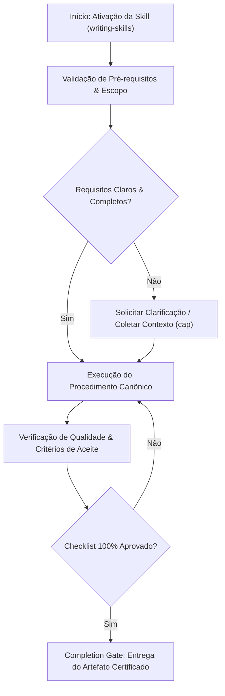

# Writing Skills

## Overview

Create effective, well-tested Claude Code skills that trigger reliably, load efficiently, and produce consistent results. This skill enforces a TDD approach to skill creation — define test prompts first, write the minimal skill, then harden against misfire and rationalization.

**This is a RIGID skill.** Every step must be followed exactly. No shortcuts.

## Phase 1: Define Test Prompts (RED)

**[HARD-GATE]** Before writing any skill content, define the prompts that should trigger it.

Write 3-5 test prompts:

| # | Test Type | Purpose | Example |
|---|-----------|---------|---------|
| 1 | Obvious trigger | Should clearly match | "Create a new React component with tests" |
| 2 | Subtle trigger | Should also match | "I need a reusable button" |
| 3 | Near-miss | Should NOT match | "Review this component code" |
| 4 | Edge case | Define expected behavior | "Create a component and write its docs" |
| 5 | Ambiguous | Define which skill wins | "Set up the frontend" |

Document expected behavior for each:
```
Test prompt: "Create a new React component with tests"
Expected: Should trigger component-creation skill
Should NOT trigger: testing-strategy, code-review, writing-skills
```

STOP — Do NOT proceed to Phase 2 until all test prompts are documented.

## Phase 2: Write Minimal SKILL.md (GREEN)

Create the minimum skill definition that passes all test prompts from Phase 1.

### Required Structure

Every SKILL.md MUST contain ALL of these elements:

| Element | Required | Purpose |
|---------|----------|---------|
| Frontmatter (`name`, `description`) | Yes | Identification and trigger matching |
| CSO-optimized description | Yes | Starts with "Use when...", lists trigger conditions |
| Overview (2-3 sentences) | Yes | Purpose and value |
| Multi-phase process with STOP markers | Yes | Numbered phases with clear actions |
| Decision tables | Yes | Tables for choosing between approaches |
| Anti-patterns / Common mistakes table | Yes | "What NOT to do" section |
| Anti-rationalization guards | Yes | HARD-GATE or "Do NOT skip" markers |
| Integration points table | Yes | How skill connects to other skills |
| Concrete examples | Yes | Code/command examples where non-obvious |
| Skill type declaration | Yes | RIGID or FLEXIBLE at the end |

### Frontmatter Rules

```yaml
---
name: skill-name          # lowercase with hyphens, unique identifier
description: "Use when [trigger conditions]"  # Max 1024 chars
related_skills:
  - cap
  - implementation
  - technical-documentation
---
```

**[HARD-GATE]** The `description` field MUST start with "Use when".

### CSO (Claude Search Optimization) Rules

The `description` field determines when a skill is selected. Optimize it like a search query.

| Rule | Explanation |
|------|-------------|
| Start with "Use when..." | Trigger condition format |
| List specific conditions, not capabilities | What activates the skill, not what it teaches |
| Maximum 1024 characters | Be concise |
| Use action verbs | "creating", "debugging", "designing", "reviewing" |

**Good:**
```yaml
description: "Use when creating database migrations, designing table schemas, adding indexes, or optimizing SQL queries"
related_skills:
  - cap
  - implementation
  - technical-documentation
```

**Bad:**
```yaml
description: "A comprehensive guide to database design covering normalization, indexing, query optimization, and migration strategies"
related_skills:
  - cap
  - implementation
  - technical-documentation
```

### Trigger Condition Patterns

| Pattern | Format | Example |
|---------|--------|---------|
| Action-based | "Use when creating..., updating..., deleting..." | CRUD operations |
| Problem-based | "Use when debugging..., fixing..., resolving..." | Bug fixes |
| Artifact-based | "Use when working with Docker files, CI configs..." | File types |
| Phase-based | "Use when starting a project, finishing a feature..." | Workflow stage |

STOP — Verify the description would match test prompts from Phase 1 before proceeding.

## Phase 3: Harden the Skill (REFACTOR)

Review and close loopholes:

| Check | Question | Fix If Failing |
|-------|----------|---------------|
| Over-triggering | Does it match prompts it should NOT? | Narrow the description |
| Under-triggering | Does it miss valid prompts? | Add missing trigger conditions |
| Rationalization | Would an agent find a way to skip steps? | Add "Do NOT skip" constraints |
| Ambiguity | Are instructions interpretable multiple ways? | Make them concrete with examples |
| Token bloat | Is it over 500 lines? | Move reference material to separate files |
| Missing gates | Are there checkpoints between phases? | Add STOP markers |

### Token Efficiency Targets

| Skill Type | Target Lines | Strategy |
|------------|-------------|----------|
| Getting-started workflows | < 100 lines | Minimal steps |
| Frequently-loaded skills | < 200 lines | Tables over prose |
| Comprehensive reference skills | < 400 lines | Split into phases |
| Maximum allowed | 500 lines | Move extras to separate files |

### Token Reduction Strategies

- Use tables instead of prose for structured information
- Use terse imperative sentences, not explanatory paragraphs
- Move reference material to separate files (loaded only when needed)
- Eliminate redundancy — say it once
- Use code examples only when the pattern is non-obvious

STOP — Re-run test prompts mentally. Does the skill trigger correctly for all 5? Does it NOT trigger for near-misses?

## Phase 4: Validate and Save

1. Verify all 10 required elements from Phase 2 are present
2. Verify token budget is within target
3. Verify STOP markers exist between phases
4. Save the SKILL.md file
5. Test by invoking the skill with each test prompt

### Validation Checklist

| # | Check | Status |
|---|-------|--------|
| 1 | Frontmatter has `name` and `description` | [ ] |
| 2 | Description starts with "Use when" | [ ] |
| 3 | Overview is 2-3 sentences | [ ] |
| 4 | Phases are numbered with STOP markers | [ ] |
| 5 | Decision tables present (not prose) | [ ] |
| 6 | Anti-patterns table present | [ ] |
| 7 | Anti-rationalization guards present | [ ] |
| 8 | Integration points table present | [ ] |
| 9 | Concrete examples present | [ ] |
| 10 | Skill type declared (RIGID/FLEXIBLE) | [ ] |
| 11 | Under 500 lines total | [ ] |

## Skill Types and Testing

### Testing by Skill Type

| Skill Type | Test Method | What to Verify |
|------------|-------------|---------------|
| **Technique** (TDD, debugging) | Apply to problem X and unusual problem Y | Produces right steps; adapts correctly |
| **Pattern** (design patterns) | Show code X (matches) and code Y (near-miss) | Identifies correctly; rejects correctly |
| **Reference** (API docs, checklists) | Ask "what is the rule for X?" and "what about edge case Z?" | Finds right answer; handles gaps |
| **Discipline** (security review) | Review correct code, then review under time pressure | Passes clean code; enforces all rules even under pressure |

## Anti-Patterns / Common Mistakes

| Mistake | Why It Is Wrong | What To Do Instead |
|---------|----------------|-------------------|
| Description describes content, not triggers | Skill never gets selected | Start with "Use when..." and list trigger conditions |
| Too broad — triggers on everything | Useful for nothing | Narrow to specific actions and artifacts |
| Too long — 1000+ lines | Wastes context tokens every invocation | Stay under 500 lines; split reference material |
| Missing constraints | Agents rationalize skipping steps | Add "Do NOT" rules and HARD-GATE markers |
| Untested against real prompts | Will misfire in production | Write test prompts BEFORE writing the skill |
| External file dependencies | Fragile — files may not exist | Self-contained or check file existence first |
| Prose where tables work | Harder to scan, more tokens | Use tables for structured comparisons |
| No STOP markers between phases | Agent blasts through without checkpoints | Add STOP after each phase |

## Anti-Rationalization Guards

- **[HARD-GATE]** Do NOT write a skill without defining test prompts first (Phase 1)
- **[HARD-GATE]** Do NOT omit the description field or use a non-"Use when" format
- **Do NOT skip** the hardening phase — every skill needs rationalization review
- **Do NOT skip** the validation checklist — all 11 items must pass
- **Do NOT** create skills over 500 lines — split into skill + reference file
- **Do NOT** use prose where a table would be clearer

## Integration Points

| Skill | Relationship |
|-------|-------------|
| `self-learning` | Skills are discovered and loaded via the skill system |
| `auto-improvement` | Tracks skill effectiveness and suggests improvements |
| `spec-writing` | Skills can be specified using JTBD methodology |
| `code-review` | Skills should be reviewed for quality before deployment |
| `testing-strategy` | Test prompts follow testing methodology |

## Concrete Example: Complete Minimal Skill

```markdown
---
name: docker-setup
description: "Use when creating Dockerfiles, docker-compose configurations, or containerizing an application for development or production"
related_skills:
  - cap
  - implementation
  - technical-documentation
---

# Docker Setup

## Overview

Guide the creation of Docker configurations for development and production environments. Produces Dockerfiles, docker-compose files, and .dockerignore with best practices.

## Phase 1: Discovery
[Ask about: runtime, ports, volumes, env vars, multi-stage needs]
STOP — confirm requirements.

## Phase 2: Generate Configuration
[Create Dockerfile, docker-compose.yml, .dockerignore]
STOP — present for review.

## Phase 3: Verify
[Build image, run container, verify health check]

## Anti-Patterns
| Mistake | Fix |
|---------|-----|
| Running as root | Use non-root USER |
| No .dockerignore | Always create one |

## Skill Type
**Flexible**
```

## Skill Type

**Rigid** — The TDD approach (test prompts first), required structure elements, and validation checklist must be followed exactly. No elements may be skipped.


## Decision Workflow




## Edge Cases & Failure Modes

- **Ambiente Restrito / Read-Only:** Se o filesystem ou sandbox estiver bloqueado contra escrita, reportar o bloqueio com evidência imediata e gerar o patch em markdown diff.
- **Conflito de Especificação:** Caso encontre contradições entre a intenção do usuário e o SSOT (`AGENTS.md`), interromper e sinalizar as opções com trade-offs.
- **Timeout ou Exaustão de Contexto:** Em tarefas volumosas, decompor em sub-lotes atômicos utilizando a skill `subagent-driven-development`.


## Domain SOTA & Industry Engineering Standards

- **Specification Standard:** Agent Skills Standard (v1.0.0) compliant with Kilo Code, OpenCode, Gemini CLI, and Antigravity.
- **Progressive Disclosure:** Minimal essential instructions in `SKILL.md` with deep domain offload into `references/` and `scripts/`.
- **Typed Frontmatter:** Strict YAML Frontmatter schema (`name`, `description`, `version`, `tags`, `related_skills`).
- **Instruction Density & Tone:** High-density, active-voice imperative guidance; zero conversational fluff.

### Agent Skills Frontmatter Formal Schema:

```yaml
---
name: "kebab-case-skill-name"
description: "High-density functional summary for semantic routing (<200 chars)"
version: "1.0.0"
tags:
  - "category"
  - "domain"
related_skills:
  - "companion-skill-1"
  - "companion-skill-2"
---
```

### Exhaustive Heuristic Decision Rules:
1. **Rule of Thumb 1 (Imperative Command Voice):** Write instructions as direct commands ("Execute", "Validate", "Inject") rather than passive descriptions ("The agent should execute").
2. **Rule of Thumb 2 (Token Ceiling Constraint):** Keep `SKILL.md` under 4,000 tokens; move detailed tables, background theory, or heavy code snippets into `references/` or companion scripts.
3. **Rule of Thumb 3 (Explicit Negative Triggers):** Always include an explicit "Do not use when" section under `## When to Use` to prevent false-positive agent routing.
4. **Rule of Thumb 4 (Executable Verification Gate):** Every skill must end with a concrete, checkable `## Completion Gate & Verification` checklist.

## Operational Verification Checklist

- [ ] Todos os pré-requisitos e arquivos-alvo foram inspecionados antes da modificação.
- [ ] O procedimento seguiu estritamente as regras e boas práticas da especialização.
- [ ] As diretrizes de segurança, tipagem e estilo foram preservadas.
- [ ] Os testes unitários ou comandos de validação foram executados com sucesso.
- [ ] O artefato final foi inspecionado contra o completion gate.

