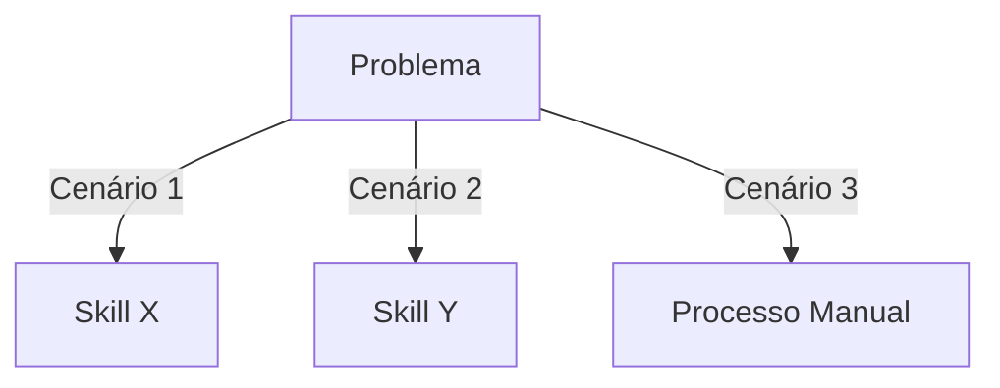

# Skill Template: Ultra-High Quality Grade

> Template base para todas as skills do ignite-agents-skills

---

## Frontmatter Schema

```yaml
---
name: {skill-name}
description: {descrição em 1 linha, máx. 200 caracteres}
version: 2.0.0
tags: [tag1, tag2, tag3]
related_skills: [skill1, skill2]
---
```

## Estrutura Obrigatória

### 1. Header
```markdown
# {Skill Name}

{Parágrafo de contexto: o que esta skill faz e por que existe}
```

### 2. Quando Usar (obrigatório)
```markdown
## Quando Usar

### Use quando:
- [Critério específico 1]
- [Critério específico 2]

### Não use quando:
- [Critério de exclusão 1]
- [Critério de exclusão 2]

### Skills relacionadas:
- `skill-xyz` — quando o problema envolve [contexto]
```

### 3. Decision Tree (obrigatório, exceto skills conceituais)
```markdown
## Decision Tree



*Se a skill for conceitual (vibe-coding, prompt-engineering), usar decision tree simplificada ou flowchart de interação.*
```

### 4. Workflow (obrigatório)
```markdown
## Workflow

### Fase 1: {Nome}
1. [Passo específico com comando/exemplo]
2. [Passo específico]
3. **Checkpoint**: [como validar esta fase]

### Fase 2: {Nome}
1. [Passo específico]
2. [Passo específico]
3. **Checkpoint**: [como validar esta fase]
```

### 5. Conceitos Fundamentais (obrigatório)
```markdown
## Conceitos Fundamentais

### {Conceito 1}
{Definição precisa}
{Exemplo de código/configuração}

### {Conceito 2}
{Definição precisa}
{Exemplo de código/configuração}
```

### 6. Templates (obrigatório)
```markdown
## Templates

### {template-name}
Localização: `templates/{template-name}.{ext}`

{Descrição do template e quando usá-lo}

**Uso:**
```bash
# Como usar o template
cp templates/{template-name}.{ext} ./{destino}
```
```

### 7. Anti-patterns (obrigatório)
```markdown
## Anti-patterns

### 🔴 Crítico
#### {Anti-pattern nome}
**O que é:** {descrição}
**Por que é ruim:** {consequência}
**Como evitar:** {remediação}
**Exemplo:**
```
# ❌ ERRADO
{código/config errado}

# ✅ CORRETO
{código/config correto}
```

### 🟡 Médio
...

### 🟢 Baixo
...
```

### 8. Checklists (obrigatório)
```markdown
## Checklists

### Checklist de {Contexto}
- [ ] Critério verificável 1
- [ ] Critério verificável 2
- [ ] Critério verificável 3
```

### 9. Edge Cases (obrigatório)
```markdown
## Edge Cases

### {Cenário}
**Situação:** {descrição}
**Solução:** {como resolver}
**Exceção:** {quando NÃO aplicar}
```

### 10. Referências (obrigatório)
```markdown
## Referências

- {Link para documentação externa}
- {Referência para skill relacionada}
- {Artigo/padrão aplicável}
```

## Diretrizes de Qualidade

### Mínimo 150 linhas
- SKILL.md deve ter pelo menos 150 linhas de conteúdo acionável
- Conteúdo deve ser executável por agentes, não apenas conceitual

### Progressive Disclosure
- Seção "Quando Usar" deve ser concisa (máx. 10 linhas)
- Detalhes técnicos em seções posteriores
- Agente pode pular para seção relevante via anchor

### Cross-references
- Cada skill deve referenciar 2-3 skills relacionadas
- Usar formato: `- `skill-name` — {contexto}`

### Templates
- Templates em arquivos separados dentro de `templates/`
- Nome do template deve ser descritivo
- Incluir instruções de uso no SKILL.md

## Checklist de Validação

- [ ] Frontmatter completo (name, description, version, tags, related_skills)
- [ ] Seção "Quando Usar" com critérios claros
- [ ] Decision tree presente (ou justificativa para ausência)
- [ ] ≥3 workflows numerados com checkpoints
- [ ] ≥3 anti-patterns com severidade e exemplos
- [ ] Checklist de validação
- [ ] ≥1 edge case documentado
- [ ] ≥1 template em arquivo separado
- [ ] ≥1 cross-reference para skill relacionada
- [ ] SKILL.md ≥150 linhas